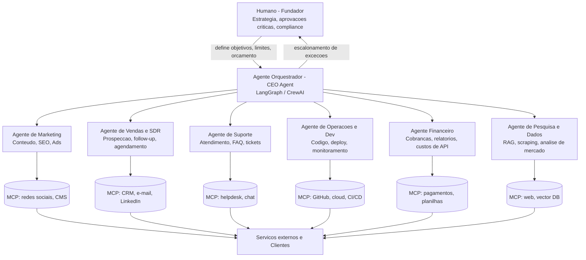
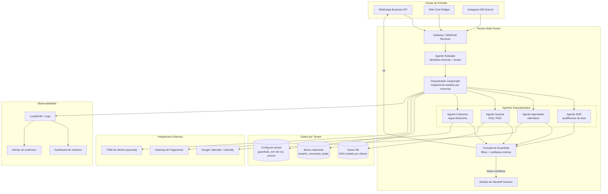

# 🤖 Projeto Capstone — Empresa Autônoma Operada por Agentes de IA

> Conectado ao **Módulo 11 — Projeto Integrador (Capstone Project)** do [Plano_de_Estudos.md](Plano_de_Estudos.md).
> Objetivo: estruturar um negócio real onde agentes de IA executam >80–90% das operações do dia a dia, com humano atuando apenas como "conselho/fundador" em decisões estratégicas, financeiras e de exceção.

---

## 1. Conceito: o que é uma "empresa autônoma"

Não existe (ainda) empresa 100% sem humano — por motivos legais (CNPJ, contratos, responsabilidade civil, conta bancária) sempre há um dono/responsável. O que **é viável hoje** é reduzir drasticamente a operação do dia a dia a um papel de:

- **Definir objetivos e orçamento** (ex.: "gastar até X em Ads/API por mês", "meta de Y clientes")
- **Aprovar exceções críticas** (reembolsos grandes, questões jurídicas, decisões > R$ valor-limite)
- **Auditoria periódica** (revisar dashboards semanais/mensais gerados pelos próprios agentes)

Todo o resto — prospecção, atendimento, criação de conteúdo, código, relatórios financeiros, otimização de campanhas — é feito por agentes especializados coordenados por um **agente orquestrador** ("CEO Agent").

### Arquitetura de referência



### Stack sugerida (reaproveitando o que você já estuda no plano)

| Camada | Ferramenta | Módulo relacionado |
|---|---|---|
| Orquestração multi-agente | LangGraph, CrewAI ou AutoGen | Módulo 4 |
| Integração com ferramentas externas | MCP (servers custom + n8n) | Módulo 3 |
| Conhecimento/memória | RAG + pgvector/Postgres | Módulo 1 e 2 |
| Modelos | OpenRouter (custo) + Ollama (tarefas locais/baratas) + Claude/GPT (tarefas críticas) | Módulo 1 |
| Observabilidade | LangSmith (logs, custo por agente, taxa de erro) | Módulo 2 |
| Infra/deploy | CI/CD com agente de Ops validando antes do deploy | Módulo 6 |
| Governança | Limites de gasto, guardrails, revisão humana amostral | Módulo 10 |

**Pontos obrigatórios de "humano no loop"**: pagamentos/contratos, compliance (LGPD se lidar com dados pessoais), decisões com risco reputacional, limite de gasto em APIs/Ads, abertura de empresa/conta bancária/emissão de notas fiscais.

---

## 2. Segmentos avaliados (matriz de decisão)

Critérios de 1 (baixo) a 5 (alto). "Dependência humana residual" — quanto menor, mais autônomo.

| Segmento | Viabilidade de automação hoje | Capital inicial | Risco regulatório | Potencial de lucro | Dependência humana residual |
|---|:---:|:---:|:---:|:---:|:---:|
| Agência de automações IA (Agentic Ops as a Service) para PMEs | 5 | 1 | 1 | 4 | 2 |
| Micro-SaaS vertical mantido por agentes de código | 4 | 2 | 1 | 4 | 2 |
| Conteúdo automatizado (newsletter/YouTube faceless/blog SEO) | 5 | 1 | 1 | 3 | 1 |
| Agência de SDR/outbound B2B (prospecção com IA) | 4 | 1 | 2 | 4 | 3 |
| Suporte terceirizado (helpdesk IA-first) para e-commerces | 4 | 1 | 2 | 3 | 2 |
| E-commerce/dropshipping "lights-out" | 3 | 3 | 2 | 3 | 3 |
| Pesquisa de mercado/inteligência competitiva (assinatura) | 4 | 1 | 1 | 3 | 2 |
| Geração/triagem de currículos e recrutamento | 3 | 2 | 3 | 3 | 3 |
| Automação jurídica (contratos, compliance) | 3 | 2 | 5 | 4 | 4 |
| Bots de trading/finanças | 2 | 3 | 5 | 3 (alto risco) | 4 |

> Regra prática: **quanto mais o produto lida com dinheiro de terceiros, saúde ou questões jurídicas, maior a dependência humana obrigatória** (regulação), mesmo que a IA consiga tecnicamente fazer o trabalho.

---

## 3. Top 4 ideias detalhadas (melhor encaixe com seu perfil atual)

### 🥇 1. Agência de Automações com Agentes de IA para PMEs ("Agentic Ops as a Service")

- **O que é**: você vende workflows de agentes (atendimento, follow-up de vendas, geração de relatórios, triagem de leads) via MCP/n8n para pequenas e médias empresas que não têm equipe técnica.
- **Por que funciona**: é exatamente o que você está estudando (Módulos 1, 3, 4). Baixo capital, alta margem (cobra-se recorrência mensal, custo real é só API + infra).
- **Como os agentes operam sozinhos**: agente de vendas qualifica leads inbound, agente de onboarding configura o workflow do cliente, agente de suporte responde dúvidas comuns, agente financeiro emite cobranças recorrentes.
- **Humano entra**: fechamento de contrato inicial, casos de suporte complexos, ajustes de workflow sob medida.
- **Modelo de receita**: assinatura mensal (R$500–R$3.000/cliente) + setup fee.

### 🥈 2. Micro-SaaS vertical "auto-mantido"

- **O que é**: um SaaS de nicho (ex.: gerador automático de contratos simples, agendador inteligente para autônomos, dashboard de métricas para pequenos e-commerces) onde agentes de dev corrigem bugs, respondem issues e fazem deploy.
- **Inspiração**: o case do levelsio citado no seu Módulo 1.
- **Humano entra**: decisões de roadmap/produto, aprovação de deploys críticos, questões de billing.
- **Modelo de receita**: assinatura SaaS (R$30–R$300/mês).

### 🥉 3. Pipeline de conteúdo automatizado (newsletter/blog/YouTube de nicho)

- **O que é**: agentes de pesquisa + redação + edição + publicação + SEO rodando num nicho específico (ex.: "IA aplicada a pequenos negócios", finanças pessoais, produtividade).
- **Por que funciona**: menor risco regulatório, menor dependência humana (quase zero depois de configurado), monetização via afiliados/ads/patrocínio/assinatura.
- **Humano entra**: revisão de qualidade/marca amostral, parcerias comerciais.
- **Modelo de receita**: afiliados, ads, assinatura paga (Substack-like), patrocínios.

### 4. Agência de SDR/Outbound B2B automatizado

- **O que é**: agentes pesquisam leads (LinkedIn, sites, bases públicas), personalizam e disparam outreach, qualificam respostas e agendam reuniões para os clientes (empresas de vendas B2B).
- **Humano entra**: compliance de spam/LGPD, ajuste de tom de voz da marca do cliente, reuniões de venda em si (ou um humano/closer contratado à parte).
- **Modelo de receita**: fee fixo + comissão por reunião agendada/fechada.

---

## 4. Roadmap sugerido de implementação (ligado ao seu plano de estudos)

- [ ] **Fase 0 — Validação (1-2 semanas)**: escolher 1 segmento (recomendado: Agência de Automações), validar com 3-5 conversas reais com potenciais clientes
- [ ] **Fase 1 — MVP do orquestrador**: montar o CEO Agent + 2 agentes especializados (ex.: vendas + suporte) usando LangGraph/CrewAI (Módulo 4)
- [ ] **Fase 2 — Integrações MCP**: conectar CRM, WhatsApp/e-mail, planilha financeira (Módulo 3)
- [ ] **Fase 3 — Observabilidade e guardrails**: logging, limites de gasto, fallback humano (Módulo 2 e 10)
- [ ] **Fase 4 — Primeiro cliente pagante real**: rodar end-to-end com supervisão próxima
- [ ] **Fase 5 — Escalar**: reduzir intervenção humana medindo "% de tarefas resolvidas sem escalonamento"

**Métrica-chave de autonomia**: `taxa de autonomia = tarefas resolvidas pelos agentes sem intervenção humana / total de tarefas`. Meta inicial realista: 70-80%. Acima de 90% costuma exigir meses de ajuste de guardrails.

---

## 5. Riscos e pontos de atenção

- **Custos de API podem escalar rápido** — definir orçamento máximo por agente/dia e alertas automáticos.
- **LGPD**: qualquer agente que lide com dados de clientes brasileiros precisa de política de privacidade e cuidado no armazenamento.
- **Responsabilidade legal**: erros de agentes (ex.: e-mail errado, promessa indevida a cliente) ainda são responsabilidade do CNPJ/humano por trás.
- **Alucinação em contato com cliente final**: sempre ter uma camada de revisão ou confiança mínima antes de agentes enviarem mensagens externas sensíveis.
- **Dependência de poucos provedores de modelo**: usar OpenRouter para não ficar refém de um único provedor.

---

## 6. Mais nichos e ideias (pensando fora da caixa)

> Esta seção expande deliberadamente além do seu plano de estudos atual — algumas ideias usam módulos que você ainda vai estudar (UX/UI, DevOps, Gestão de Projetos, Fine-Tuning), e outras fogem completamente da ementa, misturando IA com mundo físico, arbitragem de dados ou "meta-negócios" (vender IA para quem vende IA).

### A. Prévia: ideias ligadas a módulos futuros do seu plano

| Ideia | Módulo que destrava | Por que é interessante |
|---|:---:|---|
| **Agência de Design/UI gerado por IA** (landing pages, apps, design systems sob demanda) | Módulo 5 (UX/UI) | Agentes geram variações de UI, humano só aprova direção visual |
| **"AI-SRE" — monitoramento e resposta a incidentes automatizada** para startups sem time de DevOps | Módulo 6 (DevOps) | Agente detecta erro em produção, corrige ou faz rollback sozinho, só escala se não resolver |
| **Gerente de Projetos IA-as-a-Service** para squads de freelancers/agências pequenas | Módulo 7 (Gestão de Projetos) | Agente organiza sprints, cobra status, gera relatórios para o cliente final |
| **Modelos fine-tunados verticais vendidos via API** (ex.: modelo especializado em laudos médicos, jurídico, atendimento bancário) | Módulo 9 (Fine-Tuning) | Diferencial defensável — não é só prompt, é modelo treinado no seu dado proprietário |
| **"AI Red Team" — teste de segurança/prompt injection as a service** para empresas que lançam chatbots | Módulo 10 (Segurança/Governança) | Mercado nascente: toda empresa que lança IA hoje precisa validar guardrails |

### B. Micro-nichos de conteúdo e mídia (mais específicos que "newsletter genérica")

- **Localização/dublagem automatizada de vídeos e podcasts** (traduzir + dublar com voz clonada + legendas) para criadores que querem alcançar mercados internacionais — cobrar por minuto de vídeo.
- **Fábrica de cursos/micro-credenciais**: pegar conhecimento disperso (ex.: documentação técnica, normas regulatórias) e transformar em cursos estruturados automaticamente.
- **Ghostwriting de LinkedIn/redes sociais para executivos** — agentes entrevistam o executivo (via formulário/áudio) e geram posts na voz dele, agendando publicação.
- **Produção de podcast 100% automatizada**: edição, show notes, cortes para Reels/TikTok, tudo gerado por agentes a partir do áudio bruto.
- **"Faceless" em nichos ultra-específicos** (não genéricos): ex. "mudanças em leis tributárias para MEI", "vagas remotas recém-abertas em IA", "resumo diário de patentes de uma indústria específica".

### C. Arbitragem de dados e informação (o agente "sabe algo antes dos outros")

- **Monitoramento de mudanças regulatórias/compliance** por setor (ex.: agro, fintech, saúde) — agente varre diários oficiais e avisa empresas antes da concorrência.
- **Inteligência de preços/concorrência para e-commerce** — scraping contínuo + alertas de precificação, vendido como assinatura B2B.
- **Caça de editais, licitações e grants automatizada** — agente encontra oportunidades de editais/licitações compatíveis com o perfil do cliente e rascunha a proposta inicial.
- **Busca de prior art/patentes automatizada** para escritórios pequenos que não têm verba para ferramentas caras.
- **Agregador + resumidor de literatura científica** por área de pesquisa (nicho: labs pequenos, pesquisadores independentes).
- **Lead generation hiperlocal**: agente identifica negócios locais (dentistas, advogados, salões) com presença digital fraca e vende os leads qualificados para prestadores de serviço de marketing.

### D. Híbridos físico + IA (realmente fora da caixa)

- **"Negócios chatos" (boring business) com camada de IA**: lavanderias, estacionamentos, vending machines — não são "autônomos" na operação física, mas a **gestão** (precificação dinâmica, manutenção preditiva, atendimento, financeiro) pode ser 100% feita por agentes, com humano só fazendo reposição/manutenção física.
- **Airbnb/aluguel de temporada "lights-out"**: agente responde hóspedes, ajusta preço dinamicamente (yield management), coordena faxina via terceirizados, só humano decide comprar/vender o imóvel.
- **Frota de delivery/logística otimizada por IA**: roteirização e alocação automática, humano só dirige ou terceiriza a entrega.
- **Imóveis — garimpo automatizado de oportunidades**: agente cruza anúncios, registros públicos e dados de bairro para encontrar imóveis subvalorizados e alertar investidores.

### E. "Meta-negócios" — vender IA para quem vende IA

- **Marketplace de "funcionários de IA" por aluguel**: "contrate um SDR de IA por R$497/mês", "contrate um suporte de IA por R$297/mês" — produtizar os agentes do item 1 como catálogo plug-and-play.
- **Plataforma de avaliação/QA de agentes de IA de terceiros**: empresas que lançam agentes próprios pagam para um agente seu testar robustez, custo e taxa de erro antes de ir para produção.
- **Revenda white-label de chatbots/agentes** para agências de marketing que querem oferecer "IA" aos próprios clientes sem construir nada.
- **Geração e venda de dados sintéticos** para treinar outros modelos (nicho: empresas que não podem usar dados reais por LGPD/HIPAA).
- **Marketplace de prompts/workflows de agentes testados e com métricas de performance** (tipo "App Store" de automações prontas).

### F. Ideias ousadas/experimentais

- **Personagem/influenciador virtual (avatar de IA)** com conteúdo, voz e personalidade consistentes, monetizado via afiliados, marcas e assinatura de fãs.
- **Mediação automatizada de pequenas disputas** (ex.: disputas simples em marketplaces, devoluções) gerando pareceres e sugestões de acordo — reduz necessidade de atendimento humano em e-commerces grandes.
- **"Tradutor cultural" de produtos/ofertas para expansão internacional**: agente adapta copy, preço e posicionamento de um produto para novos mercados automaticamente.
- **Negociação automatizada com fornecedores** (procurement): agente conduz parte da negociação por e-mail/chat com base em regras definidas pelo humano.
- **Banco de horas de "co-pilotos" de nicho**: um agente especializado profundamente em uma única tarefa muito específica e tediosa (ex.: só concilia notas fiscais, só responde reclamações do Reclame Aqui) vendido isoladamente — mais fácil de confiar e mais fácil de automatizar 100%.

### Como escolher entre tantas opções

1. **Teste de "dor cara e repetitiva"**: a ideia resolve algo que o cliente hoje paga caro para um humano fazer de forma repetitiva? (sinal forte de produto-mercado)
2. **Teste de "dado proprietário"**: você consegue acumular um dado/histórico que fica melhor com o tempo (moat), ou é só um wrapper fácil de copiar?
3. **Teste de "erro tolerável"**: o que acontece se o agente errar uma vez? Se a resposta for "catástrofe", precisa de muito humano no loop (evite para MVP). Se for "incômodo pequeno e reversível", é ideal para autonomia alta.
4. **Teste de distribuição**: você já tem (ou consegue gerar rápido) acesso ao público-alvo, ou vai gastar meses só adquirindo clientes?

---

## 7. Deep Dive: Agência de Automações IA (Agentic Ops as a Service) para PMEs

> Refinamento da ideia #1 da seção 3 — a mais recomendada para começar.

### 7.1 Proposta de valor refinada

Não venda "IA" — venda **resultado de negócio**: "pare de perder leads que não recebem resposta em 5 minutos", "recupere 20% dos carrinhos abandonados", "nunca mais perca uma consulta por falta de confirmação". A IA é o *como*, não o *o quê*.

Modelo mental do produto: você não entrega "um chatbot". Você entrega um **funcionário digital terceirizado** com uma função clara (SDR, recepcionista, cobrador, pós-venda), que roda 24/7 e é monitorado por você.

### 7.2 O que implementar (produto/tecnologia)

**Camada 1 — Núcleo reutilizável (construir uma vez, usar em todos os clientes)**

- [ ] **Agente Orquestrador genérico** (LangGraph/CrewAI) com roteamento por intenção (venda, suporte, agendamento, cobrança)
- [ ] **Conector de canal de entrada**: WhatsApp Business API (via provedor tipo Z-API, Twilio, Meta Cloud API ou Evolution API self-hosted) — é o canal #1 para PMEs no Brasil
- [ ] **Camada de memória/RAG por cliente**: cada cliente tem sua própria base vetorial (produtos, preços, políticas, FAQ) isolada — multi-tenant desde o início
- [ ] **Agente de agendamento**: integração com Google Calendar/Calendly para marcar, remarcar e confirmar horários automaticamente
- [ ] **Agente de qualificação de leads (SDR)**: faz perguntas de qualificação, pontua o lead (BANT ou similar) e decide se agenda, escala para humano ou descarta
- [ ] **Agente de cobrança/recall**: lembra pagamentos, renovações, consultas de retorno, carrinho abandonado
- [ ] **Painel de observabilidade** (seu, não do cliente, inicialmente): custo por conversa, taxa de resolução sem humano, tempo de resposta, sentimento do cliente
- [ ] **Guardrails configuráveis por cliente**: lista de tópicos proibidos, limite de desconto que o agente pode oferecer, quando escalar para humano (ex.: menção a reclamação grave, palavras-gatilho jurídicas)
- [ ] **Mecanismo de fallback/handoff humano**: transferência suave para um humano do próprio cliente quando o agente não tem confiança na resposta

**Camada 2 — Configuração por cliente (onboarding, não é "código novo")**

- [ ] Formulário/entrevista de onboarding (pode ser feito por um agente de onboarding!) que extrai: tom de voz, produtos/serviços, política de cancelamento, horários de funcionamento, preços
- [ ] Ingestão automática de documentos do cliente (cardápio, catálogo, tabela de preços, PDFs) para popular o RAG
- [ ] Dashboard simples (ou relatório semanal automático por e-mail/WhatsApp) mostrando ao cliente final: conversas atendidas, leads gerados, horários marcados

**Camada 3 — Integrações por nicho (construir sob demanda, conforme você fecha clientes de um nicho)**

- [ ] Conectores com sistemas específicos: PDV de clínicas, CRMs imobiliários, ERPs de pequenas empresas, plataformas de e-commerce (Shopify, Nuvemshop, Mercado Livre)

### 7.3 O que gerenciar (operação do negócio)

| Área | O que envolve | Pode ser agente? |
|---|---|:---:|
| **Prospecção e vendas** | Encontrar donos de PME, demonstrar produto, fechar contrato | Parcial — agente prospecta/agenda, humano fecha no início |
| **Onboarding de cliente novo** | Coletar informações, configurar agente, testar antes de ir ao ar | Majoritariamente agente, com checkpoint humano de QA |
| **Monitoramento contínuo** | Garantir que agentes dos clientes não estão errando, alucinando ou ofendendo clientes finais | Agente monitora, humano revisa amostra semanal |
| **Suporte ao cliente (dono da PME)** | Dúvidas, ajustes de configuração, reclamações | Agente de suporte nível 1, humano nível 2 |
| **Financeiro/cobrança recorrente** | Emitir cobranças, lidar com inadimplência, custos de API por cliente | Quase 100% agente (gateway de pagamento + régua de cobrança) |
| **Compliance/LGPD** | Política de privacidade, consentimento para uso de WhatsApp, retenção de dados | Humano define política, agente aplica/registra consentimento |
| **Atualização de guardrails** | Ajustar o que o agente pode/não pode dizer conforme incidentes | Humano decide, agente implementa |
| **Relação comercial (upsell/renovação)** | Expandir contrato, evitar churn | Agente identifica sinais de risco de churn, humano faz a conversa de retenção no início |

### 7.4 Produtizando: catálogo de "funcionários digitais" (pacotes prontos)

Transformar a oferta em produtos com nome e preço fixo facilita vender (menos "projeto sob medida", mais "prateleira"):

| Produto | Função | Ticket sugerido/mês |
|---|---|:---:|
| **Recepcionista IA** | Responde WhatsApp, tira dúvidas, horário de funcionamento, FAQ | R$ 297–497 |
| **Agendador IA** | Marca, confirma e remarca horários automaticamente | R$ 397–697 |
| **SDR IA** | Qualifica leads inbound e agenda reunião/visita | R$ 697–1.497 |
| **Cobrador IA** | Lembretes de pagamento, renegociação simples, recall de inadimplentes | R$ 497–997 |
| **Pós-venda IA** | Pesquisa de satisfação, reativação de clientes inativos, upsell simples | R$ 397–797 |
| **Pacote completo** | Todos os anteriores integrados | R$ 1.500–3.500 |

> Preço real depende do custo de API por volume de conversa — monitore o custo marginal por conversa e mantenha margem de pelo menos 70-80%.

### 7.5 Nichos promissores (análise detalhada)

Critério de ranking: volume de comunicação repetitiva + ticket médio do cliente final + baixa maturidade digital atual + baixo risco regulatório.

| Nicho | Dor principal | Automação de maior impacto | Por que é promissor | Risco/complexidade |
|---|---|---|---|:---:|
| **Clínicas odontológicas e estéticas** | Falta/atraso em consultas, recall de manutenção | Agendador + confirmação + recall de retorno | Ticket alto do cliente final, alta tolerância a pagar por "não perder cadeira vazia" | Baixo |
| **Clínicas veterinárias/pet shops** | Agendamento, lembrete de vacina/banho | Agendador + recall + upsell de produtos | Mercado pet aquecido no Brasil, dono de pet responde bem a lembretes automáticos | Baixo |
| **Imobiliárias e corretores autônomos** | Leads de portais (ZAP, QuintoAndar) não respondidos a tempo | SDR IA que responde em segundos e agenda visita | Resposta rápida é o maior diferencial competitivo do setor | Médio (integração com portais) |
| **Escritórios de advocacia pequenos/médios** | Triagem de novos casos, follow-up de propostas | SDR IA + geração de documentos simples | Ticket alto, advogados odeiam tarefas administrativas repetitivas | Médio (cuidado com promessa de "aconselhamento jurídico") |
| **Academias, boxes de crossfit, estúdios de pilates** | Churn de alunos, renovação de plano | Pós-venda IA (reativação) + cobrador IA | Churn é o maior problema do setor, pouca automação hoje | Baixo |
| **Escolas de idiomas e cursos livres** | Conversão de aula experimental em matrícula | SDR IA + agendador de aula teste | Ciclo de vendas curto, decisão emocional, bom para automação de follow-up | Baixo |
| **Contabilidade para pequenas empresas** | Coletar documentos dos clientes todo mês (a dor #1 do setor) | Agente que cobra, recebe e organiza documentos via WhatsApp | Dor universal e constante (mensal), poucos concorrentes automatizando isso bem | Baixo |
| **Concessionárias/revendas de veículos (usados)** | Follow-up de test drive, simulação de financiamento | SDR IA + nutrição de lead frio | Ticket altíssimo do produto final, justifica qualquer investimento em automação | Médio |
| **Salões de beleza e barbearias** | Agendamento, no-show | Agendador + confirmação + lembrete | Alto volume de PMEs nesse segmento = mercado grande para replicar | Baixo |
| **Corretoras de seguros pequenas** | Renovação de apólice, cotação rápida | Cobrador/renovação IA + SDR para cotações | Renovação é recorrente e previsível, ótimo para automação de régua | Médio (regulação de seguros) |
| **E-commerces pequenos/médios (Shopify, Nuvemshop)** | Suporte repetitivo, carrinho abandonado | Suporte IA + recuperação de carrinho | Já é digital, fácil de integrar, dor de suporte é universal | Baixo |
| **Restaurantes e delivery próprio (fora de iFood)** | Pedidos via WhatsApp manual, reservas | Atendente de pedidos IA + reservas | Alto volume de mensagens repetitivas, operação sensível a tempo | Baixo |

**Top 3 recomendados para validar primeiro** (melhor relação esforço × retorno × facilidade de vender):

1. 🥇 **Clínicas (odonto/estética/vet)** — ticket alto, dor óbvia (cadeira vazia = prejuízo direto), fácil de demonstrar ROI em uma reunião.
2. 🥈 **Contabilidade** — dor mensal recorrente e universal, baixa complexidade técnica, contadores costumam indicar uns aos outros (viral dentro da categoria).
3. 🥉 **Imobiliárias/corretores autônomos** — resposta rápida é a métrica que mais importa no setor, fácil de provar com teste A/B (tempo de resposta antes/depois).

### 7.6 Plano de implementação específico (8-10 semanas até o primeiro cliente pagante)

- [ ] **Semana 1-2**: escolher 1 nicho-piloto (recomendado: clínicas), entrevistar 5 donos de negócio (mesmo que informalmente) para validar a dor
- [ ] **Semana 3-4**: construir o núcleo reutilizável (Camada 1) com um caso de uso só (ex.: agendador + confirmação)
- [ ] **Semana 5**: testar com um cliente "beta" de graça ou com desconto grande, em troca de feedback e case de sucesso
- [ ] **Semana 6-7**: ajustar guardrails e fluxo de handoff humano com base nos erros reais do beta
- [ ] **Semana 8**: formalizar contrato, precificação e processo de onboarding repetível
- [ ] **Semana 9-10**: buscar clientes 2 e 3 no mesmo nicho para começar a ter um "playbook" replicável antes de expandir para outro nicho

### 7.7 Papéis humanos que você (ou sócio/contratado) ainda precisa cobrir

- **Vendas consultivas iniciais**: PME compra de quem confia, pelo menos nos primeiros clientes — dificilmente fecha 100% via agente no começo.
- **QA de cada novo cliente antes de ir ao ar**: revisar manualmente as primeiras conversas simuladas.
- **Gestão de incidentes graves**: se o agente prometer algo errado a um cliente final, alguém precisa resolver rápido para não gerar dano reputacional ao seu cliente (a PME).
- **Relacionamento e retenção**: ligação/mensagem humana ocasional para clientes que pagam R$1.000+/mês ajuda a reduzir churn, mesmo que o produto seja "autônomo".

### 7.8 Riscos específicos deste modelo

- **Concentração de risco**: um erro do seu agente em um cliente pode virar reclamação pública do cliente final contra a PME — contrato precisa deixar claro limites de responsabilidade.
- **Canal dependente de terceiro**: WhatsApp Business API pode mudar regras/custos (Meta) — diversifique para Instagram DM/web chat quando possível.
- **Commoditização rápida**: esse nicho (agências de automação) está crescendo rápido — diferencial real vem de especialização por nicho + qualidade de execução, não da tecnologia em si (qualquer um usa os mesmos modelos).
- **Custo variável de API**: cliente com alto volume de conversas pode corroer sua margem — monitore custo por conversa por cliente e ajuste preço ou limite de uso.

### 7.9 Métricas de negócio para acompanhar

- **Taxa de resposta em < 1 minuto** (proxy de qualidade percebida pelo cliente final)
- **Taxa de handoff humano** (quanto menor, mais autônomo — mas cuidado para não sacrificar qualidade)
- **Custo de API por cliente/mês** vs. **receita por cliente/mês** (margem real)
- **Churn mensal de clientes (PMEs)**
- **NPS ou satisfação do cliente final** (quem conversa com o agente, não só quem paga)
- **Tempo de onboarding** (da assinatura do contrato até o agente "ao vivo")

---

## 8. Especificação Técnica de Implementação

> Esta seção traduz o deep dive de negócio (seção 7) em um plano técnico executável: arquitetura, stack, modelo de dados, especificação de cada agente e sprints de desenvolvimento.

### 8.1 Arquitetura técnica de referência



### 8.2 Stack tecnológica concreta

| Camada | Escolha recomendada | Alternativas | Justificativa |
|---|---|---|---|
| Linguagem principal | Python | TypeScript/Node | Ecossistema LangGraph/LangChain mais maduro em Python |
| Orquestração de agentes | LangGraph | CrewAI, AutoGen | Controle fino de estado da conversa (máquina de estados), essencial para handoff e guardrails |
| Modelos LLM | OpenRouter como gateway (roteia para Claude/GPT/Gemini conforme tarefa) | Direto na OpenAI/Anthropic | Evita lock-in e permite usar modelo barato para tarefas simples e modelo forte só quando necessário |
| Modelo barato (roteamento, classificação de intenção) | Modelo pequeno (ex.: Haiku, GPT-mini, Llama via Groq) | — | Custo baixo para 80% das mensagens (saudação, FAQ simples) |
| Modelo "forte" (qualificação complexa, casos ambíguos) | Claude Sonnet / GPT grande | — | Reservado para decisões que importam (ex.: decidir se escala para humano) |
| Canal WhatsApp | Evolution API (self-hosted, grátis) para validar ideia | Z-API, Twilio, Meta Cloud API oficial (para escalar com segurança) | Começar barato, migrar para API oficial da Meta quando tiver clientes pagantes reais (mais estável, sem risco de ban) |
| Banco relacional | PostgreSQL | MySQL | Já é o que você usa no Módulo 1 (RAG), reaproveita conhecimento |
| Vector DB | pgvector (dentro do próprio Postgres) | Pinecone, Qdrant | Simplifica infra (um banco só) para o estágio inicial |
| Fila/mensageria (processar conversas de forma assíncrona) | Redis + RQ/Celery | AWS SQS | Necessário para não travar o webhook do WhatsApp esperando resposta do LLM |
| Backend/API | FastAPI | Flask, Node/Express | Assíncrono nativo, type hints, fácil de documentar com OpenAPI |
| Agendamento | Google Calendar API | Calendly API | Mais PMEs já usam Google Agenda do que Calendly |
| Pagamento/cobrança recorrente | Stripe ou Asaas (nacional) | Pagar.me | Asaas tem boleto/PIX nativo, melhor para PME brasileira |
| Observabilidade de agentes | LangSmith | Langfuse (open-source) | LangSmith integra direto com LangGraph; Langfuse se quiser self-hosted |
| Deploy/infra | Railway ou Render (início) → migrar para AWS/GCP depois | Fly.io, VPS própria | Começar simples e barato, sem gerenciar Kubernetes no MVP |
| Dashboard interno | Streamlit ou Retool (rápido de montar) | Next.js custom | Não vale investir em frontend custom antes de validar o negócio |

### 8.3 Modelo de dados (multi-tenant) — entidades principais

```
tenants              → id, nome_empresa, nicho, plano, status, data_criacao
tenant_config        → tenant_id, tom_de_voz, horario_funcionamento, limite_desconto,
                        topicos_proibidos, confianca_minima_handoff
tenant_knowledge     → tenant_id, documento_origem, chunks (embeddings via pgvector)
conversations        → id, tenant_id, canal, contato_id, status, agente_atual, iniciado_em
messages             → id, conversation_id, remetente (lead/agente/humano), conteudo, timestamp
leads                → id, tenant_id, conversation_id, nome, telefone, score_qualificacao, status
appointments         → id, tenant_id, lead_id, data_hora, status (confirmado/remarcado/no-show)
billing_events       → id, tenant_id, tipo (cobranca/lembrete), status, valor
usage_metrics        → tenant_id, data, tokens_consumidos, custo_usd, num_conversas, num_handoffs
handoff_log          → id, conversation_id, motivo, confianca_no_momento, resolvido_por_humano
```

> **Princípio de isolamento**: toda query inclui `tenant_id` — nunca confiar apenas em permissões de aplicação; usar Row-Level Security do Postgres como segunda camada de defesa contra vazamento de dados entre clientes.

### 8.4 Especificação de cada agente

**Agente Roteador** (primeiro a receber qualquer mensagem)
- Entrada: mensagem bruta + histórico curto da conversa + tenant_id
- Saída: classificação de intenção (venda/suporte/agendamento/cobrança/outro) + confiança
- Modelo: barato/rápido (latência é crítica aqui)
- Regra: se confiança < threshold, assume "suporte geral" como padrão seguro

**Agente SDR**
- Ferramentas (tools): consultar RAG do tenant, registrar lead no banco, marcar score de qualificação
- Prompt system inclui: perguntas de qualificação específicas do nicho, critérios de "lead quente"
- Saída esperada: lead qualificado + decisão (agendar / nutrir / descartar)
- Guardrail: nunca inventar preço/condição que não esteja na base de conhecimento do tenant

**Agente Agendador**
- Ferramentas: Google Calendar API (consultar disponibilidade, criar evento), enviar confirmação
- Trata: criação, remarcação, cancelamento, lembrete automático (D-1, H-2)
- Guardrail: nunca marcar fora do horário de funcionamento configurado pelo tenant

**Agente de Suporte**
- Ferramentas: busca RAG (tenant_knowledge), consulta FAQ
- Guardrail principal: se pergunta não tem resposta na base com confiança suficiente → handoff, nunca "chutar"

**Agente de Cobrança**
- Ferramentas: consultar status de pagamento (gateway), gerar link de pagamento, aplicar régua de mensagens (D-3, D0, D+3, D+7)
- Guardrail: nunca negociar desconto acima do limite configurado sem escalar para humano

**Módulo de Guardrails (não é bem um "agente", é uma camada transversal)**
- Checklist aplicado após toda resposta gerada, antes de enviar ao cliente final:
  - Contém tópico da lista de proibidos do tenant?
  - Menciona valor/desconto acima do limite?
  - Score de confiança do modelo abaixo do mínimo?
  - Mensagem do lead contém palavras-gatilho (ex.: "processo", "Procon", "cancelar tudo")?
  - Se qualquer item acima disparar → handoff humano + log do motivo

### 8.5 Estrutura de repositório sugerida

```
agentic-ops-saas/
├── apps/
│   ├── api/                  # FastAPI - webhooks, REST API
│   ├── worker/                # workers assíncronos (fila Redis)
│   └── dashboard/             # Streamlit/Retool interno
├── agents/
│   ├── router/
│   ├── sdr/
│   ├── scheduler/
│   ├── support/
│   └── billing/
├── core/
│   ├── orchestrator/          # grafo LangGraph compartilhado
│   ├── guardrails/
│   ├── rag/                   # ingestão + retrieval multi-tenant
│   └── observability/
├── integrations/
│   ├── whatsapp/
│   ├── calendar/
│   └── payments/
├── db/
│   ├── migrations/
│   └── models/
├── tests/
└── infra/
    ├── docker-compose.yml
    └── deploy/
```

### 8.6 MCP servers a construir (reaproveitando o Módulo 3 do seu plano)

| MCP Server | Função | Prioridade |
|---|---|:---:|
| `mcp-whatsapp` | Enviar/receber mensagens, templates aprovados pela Meta | Alta (MVP) |
| `mcp-calendar` | Consultar/criar/cancelar eventos no Google Calendar | Alta (MVP) |
| `mcp-tenant-knowledge` | Ingestão e busca RAG por tenant | Alta (MVP) |
| `mcp-billing` | Emitir cobranças, consultar status de pagamento | Média |
| `mcp-crm-connector` | Sincronizar leads/conversas com CRM do cliente (quando houver) | Baixa (sob demanda) |

### 8.7 Plano de sprints técnicos (6 sprints de 2 semanas ≈ 12 semanas)

- [ ] **Sprint 1 — Fundação**: setup do repo, Postgres + pgvector, FastAPI básico, webhook do WhatsApp recebendo mensagens (sem IA ainda, só eco)
- [ ] **Sprint 2 — Primeiro agente**: Agente Roteador + Agente de Suporte com RAG funcionando para 1 tenant fixo (hardcoded)
- [ ] **Sprint 3 — Multi-tenancy real**: modelo de dados completo, onboarding programático de um novo tenant, isolamento testado
- [ ] **Sprint 4 — Agendador**: integração Google Calendar, régua de confirmação/lembrete
- [ ] **Sprint 5 — SDR + Guardrails**: qualificação de lead, camada de guardrails completa, handoff humano funcionando
- [ ] **Sprint 6 — Observabilidade e billing**: LangSmith integrado, dashboard de custo/uso por tenant, cobrança recorrente via Asaas/Stripe

> Este cronograma técnico roda **em paralelo** ao cronograma de negócio da seção 7.6 — ideal é ter o Sprint 2-3 pronto no momento de buscar o primeiro cliente beta.

### 8.8 Modelo de custo e precificação (cálculo prático)

```
custo_por_conversa ≈ (tokens_entrada + tokens_saida) × preco_do_modelo
custo_mensal_tenant ≈ custo_por_conversa × num_conversas_mes + custo_fixo_infra_rateado

Exemplo (modelo barato, ~$0,25/1M tokens entrada, ~$1,25/1M saída):
- Conversa média: 2.000 tokens entrada + 500 tokens saída ≈ $0,0013
- 1.000 conversas/mês ≈ $1,30 de custo de modelo
- Margem alvo 75-80% → preço mínimo defensável mesmo no plano de entrada (R$297)
```

- [ ] Implementar contador de tokens por conversa desde o Sprint 2 (não deixar para depois — é fácil perder visibilidade de custo)
- [ ] Definir limite de "conversas incluídas" por plano e cobrar excedente (evita cliente de alto volume quebrar sua margem)
- [ ] Alertar automaticamente (agente financeiro) quando custo de um tenant específico ultrapassar X% da receita dele

### 8.9 Checklist de segurança e compliance técnico

- [ ] Row-Level Security no Postgres por `tenant_id`
- [ ] Criptografia em repouso para dados de contato (telefone, nome) — LGPD
- [ ] Opt-in explícito registrado antes do primeiro contato automatizado via WhatsApp
- [ ] Rate limiting por tenant (evitar abuso e estourar custo)
- [ ] Logs de auditoria (quem/quando configurou guardrails, quem aprovou handoff)
- [ ] Rotina de teste de prompt injection antes de cada novo nicho entrar em produção (ligação com Módulo 10 do seu plano)
- [ ] Chave de API de cada tenant isolada se usar canal próprio (evitar que erro de um cliente afete outro)

### 8.10 Definição de "pronto para vender" (critério de saída do MVP)

O MVP técnico está pronto para o primeiro cliente pagante quando:

- [ ] Um novo tenant pode ser configurado em menos de 2 horas de trabalho manual
- [ ] Taxa de handoff em ambiente de teste < 30% (sinal de que os agentes resolvem a maioria sozinhos)
- [ ] Todo guardrail crítico (preço, tópico proibido, confiança mínima) está testado com casos adversariais
- [ ] Dashboard mostra, em tempo real, custo e volume de conversas por tenant
- [ ] Existe processo documentado de rollback/pausa rápida de um tenant em caso de incidente

---

## 9. Marca, Nome e Lançamento Oficial da Empresa

> Transformando o projeto técnico/comercial em uma empresa real: identidade, registro legal e checklist de lançamento.

### 9.1 Critérios usados para o naming

- Curto, fácil de falar e lembrar (ideal: 1-2 palavras, até 10-12 caracteres)
- Transmite a ideia central: **sempre ativo, confiável, uma "equipe" que nunca para**
- Funciona bem como prefixo/sufixo dos produtos já definidos na seção 7.4 (ex.: "Recepcionista [Marca]", "SDR [Marca]")
- Domínio `.com.br` e handles de redes sociais plausivelmente disponíveis (checar antes de decidir)
- Baixo risco de conflito de marca já registrada no INPI (fazer busca prévia antes de investir em identidade visual)

### 9.2 Opções de nome avaliadas

| Nome | Conceito por trás | Tagline sugerida | Pontos fortes | Pontos de atenção |
|---|---|---|---|---|
| **Plantão.AI** 🥇 | "Plantão" = time de prontidão 24h (plantão médico, plantão de atendimento) — metáfora muito forte e 100% reconhecível no Brasil | *"Sua equipe que nunca sai de plantão"* | Conceito imediatamente compreendido por qualquer dono de PME, reforça "nunca perde um lead/cliente" | ".ai" pode confundir público menos técnico; considerar também plantao.com.br |
| **Sentinela AI** | Sentinela = quem vigia e protege constantemente | *"Sempre de olho no seu negócio"* | Transmite proteção/confiança, soa sério e profissional | Pode soar "vigilância/segurança" demais, menos "vendas" |
| **Equipe Synth** | "Equipe sintética" — deixa claro que é uma equipe, só que de IA | *"Sua próxima contratação não dorme"* | Nome literal e honesto sobre o produto | "Synth" remete a música/sintetizador, pode gerar associação errada |
| **Opera24** | "Opera" (verbo operar) + 24 (24 horas) | *"Opera 24h para o seu negócio"* | Direto, remete a operação contínua, fácil de internacionalizar | Mais "corporativo/frio", menos emocional |
| **Zelo AI** | "Zelo" = cuidado, dedicação intensa | *"Cuidado de IA para o seu negócio"* | Nome curto, sonoro, transmite carinho + responsabilidade | Pode ser confundido com "zelador" (faxina/manutenção predial) |
| **Nexo Ops** | "Nexo" = conexão/ligação entre as partes | *"O elo entre seu negócio e seus clientes"* | Soa técnico e moderno, bom para pitch a investidores | Menos acessível/emocional para dono de PME leigo |
| **Presente.AI** | Trocadilho: "presente" (sempre lá) + "presente" (um presente para o negócio) | *"Sempre presente, nunca ausente"* | Trocadilho memorável em português | Pode soar confuso fora do contexto da tagline |

### 9.3 Recomendação final e pacote de marca

**Nome recomendado: Plantão.AI** (alternativa de registro formal: "Plantão Operações Inteligentes" ou similar para o contrato social).

- **Posicionamento**: *"A equipe de IA que fica de plantão pelo seu negócio — 24 horas por dia, 7 dias por semana, sem faltar um dia."*
- **Missão**: eliminar a perda de oportunidades (leads, agendamentos, cobranças) por falta de resposta rápida em pequenas e médias empresas.
- **Tom de voz**: direto, confiável, sem jargão técnico — fala com o dono do negócio, não com o programador dele.
- **Paleta de cores sugerida**: azul-petróleo (confiança/tecnologia) + verde-menta ou âmbar como cor de destaque (energia/ação) — evitar roxo/gradiente genérico "IA de prompt de imagem" que já está saturado no mercado.
- **Conceito de logo**: ícone simples que remeta a "sempre ativo" — ex.: um ponto/sinal de status "online" estilizado, ou um símbolo de turno/relógio 24h minimalista. Gerar variações com uma ferramenta de IA de imagem (Midjourney, DALL·E, Ideogram) a partir deste briefing.
- **Convenção de nome dos produtos** (alinhando com o catálogo da seção 7.4):
  - Recepcionista Plantão.AI
  - Agendador Plantão.AI
  - SDR Plantão.AI
  - Cobrador Plantão.AI
  - Pós-venda Plantão.AI
- **Domínios a registrar**: `plantao.ai` (se disponível), `plantaoai.com.br`, `useplantao.com` como alternativa internacional
- **Handles a reservar**: Instagram, LinkedIn (prioritário para B2B), TikTok (para conteúdo educativo de automação)

> ⚠️ Antes de investir em identidade visual: fazer busca de disponibilidade de marca no [INPI – Busca de Marcas](https://busca.inpi.gov.br/pePI/) e de domínio em um registrador (Registro.br para `.com.br`).

### 9.4 Abertura formal da empresa (Brasil)

- [ ] **Definir natureza jurídica**: Sociedade Limitada Unipessoal (SLU) é geralmente a melhor opção para fundador único com responsabilidade limitada (separa patrimônio pessoal do da empresa) — MEI não é recomendado aqui, pois o limite de faturamento (R$81 mil/ano) é baixo demais para esse modelo de negócio
- [ ] **Escolher CNAE(s) principal e secundários**: ex. 62.02-3/00 (desenvolvimento e licenciamento de programas de computador customizáveis), 62.09-1/00 (suporte técnico), 73.19-0/02 (promoção de vendas) — validar com contador
- [ ] **Regime tributário**: Simples Nacional é o ponto de partida natural; atenção ao **Fator R** (Anexo III vs. Anexo V) — como o modelo de negócio depende pouco de folha de pagamento humana, o Fator R tende a ficar baixo, podendo empurrar a empresa para o Anexo V (alíquota mais alta). Um contador pode ajudar a estruturar pró-labore de forma a otimizar isso — **ironia direta do próprio conceito de "empresa autônoma"**: ter poucos humanos na folha pode custar mais caro em imposto.
- [ ] **Contratar um contador** (ou serviço de contabilidade online tipo Contabilizei, Agilize) desde o primeiro mês — não tentar fazer isso sozinho
- [ ] **Abrir conta PJ** em banco digital (Nubank PJ, Inter, C6 Bank) — baixa burocracia e taxas menores que bancos tradicionais
- [ ] **Emissão de notas fiscais**: configurar emissor de NFS-e (nota fiscal de serviço) compatível com a prefeitura do município de registro
- [ ] **Contrato de prestação de serviço padrão**: redigir (com apoio jurídico) um contrato-modelo que deixe claro limites de responsabilidade sobre erros dos agentes de IA perante o cliente final (ligado ao risco da seção 7.8)
- [ ] **Política de privacidade e termos de uso**: obrigatório por LGPD, já que o produto processa dados de leads/clientes dos seus clientes (dados de terceiros)

### 9.5 Checklist de presença digital e lançamento

- [ ] Registrar domínio(s) e configurar e-mail profissional (ex.: Google Workspace)
- [ ] Criar landing page one-page: proposta de valor, catálogo de produtos (seção 7.4), prova social (mesmo que inicial/depoimento do cliente beta), CTA para WhatsApp/agendamento de demo
- [ ] Reservar handles de redes sociais antes que alguém registre
- [ ] Preparar um pitch/demo de 2 minutos gravado em vídeo mostrando o agente respondendo uma conversa real simulada do nicho escolhido (clínicas)
- [ ] Criar material de vendas simples (PDF de 1 página) com o catálogo de produtos e preços para enviar a leads
- [ ] Configurar o próprio WhatsApp Business da empresa — ironia útil: a primeira demonstração para o cliente pode ser literalmente conversar com seu próprio agente SDR

### 9.6 Linha do tempo de lançamento (integrando seções 7 e 8)

| Semana | Negócio (seção 7.6) | Produto/Tech (seção 8.7) | Marca/Legal (seção 9) |
|:---:|---|---|---|
| 1-2 | Validar dor com 5 donos de clínica | Sprint 1 — Fundação técnica | Escolher nome final, checar INPI/domínio, abrir empresa |
| 3-4 | — | Sprint 2 — Primeiro agente | Registrar domínio, redes sociais, logo inicial |
| 5 | Cliente beta gratuito/desconto | Sprint 3 — Multi-tenancy | Landing page no ar |
| 6-7 | Ajustar com base no beta | Sprint 4-5 — Agendador + SDR/Guardrails | Contrato de prestação de serviço finalizado |
| 8 | Formalizar contrato e preço | Sprint 6 — Observabilidade/billing | Conta PJ, emissão de NF, contador ativo |
| 9-10 | Buscar clientes 2 e 3 | Buffer/ajustes finais | Primeiro material de vendas e pitch gravado |

---

## 📝 Notas e decisões

> _(use este espaço para registrar qual segmento você escolheu e por quê, conforme for validando)_
