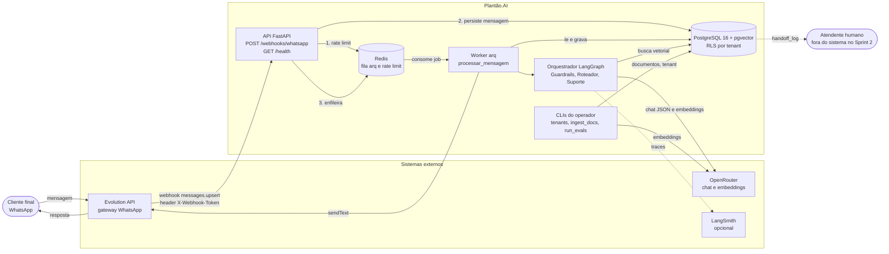
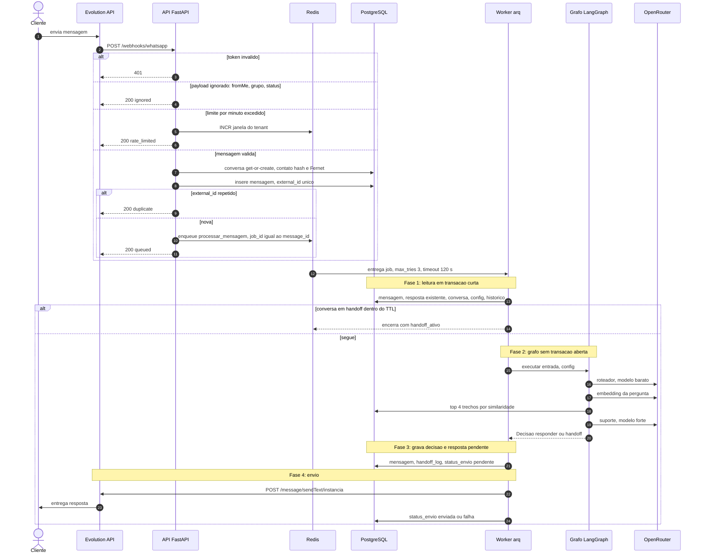
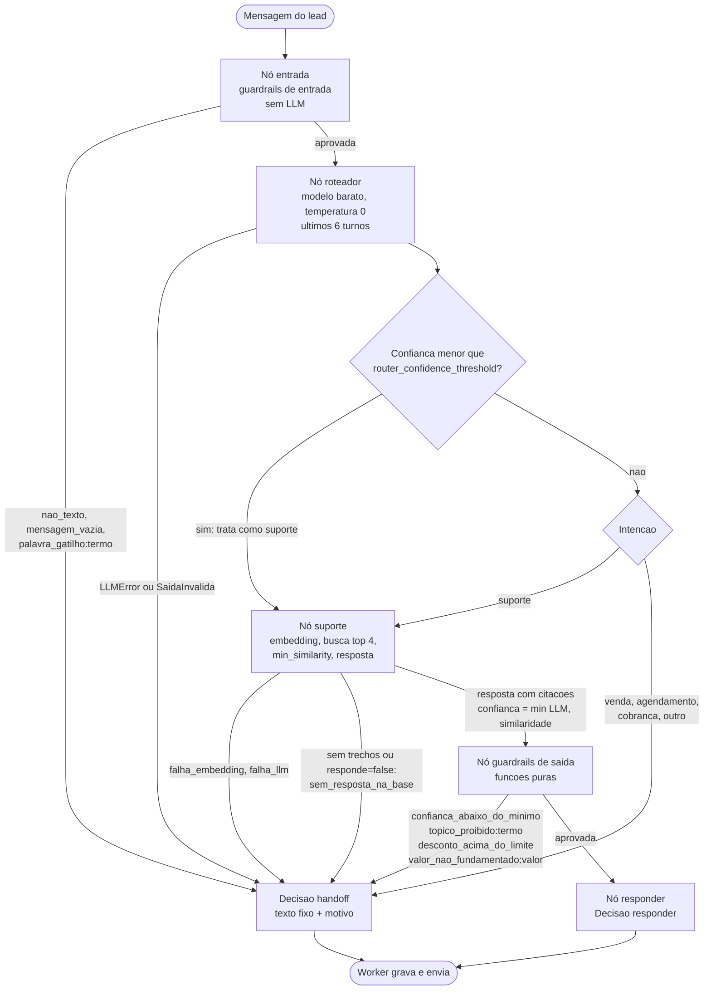
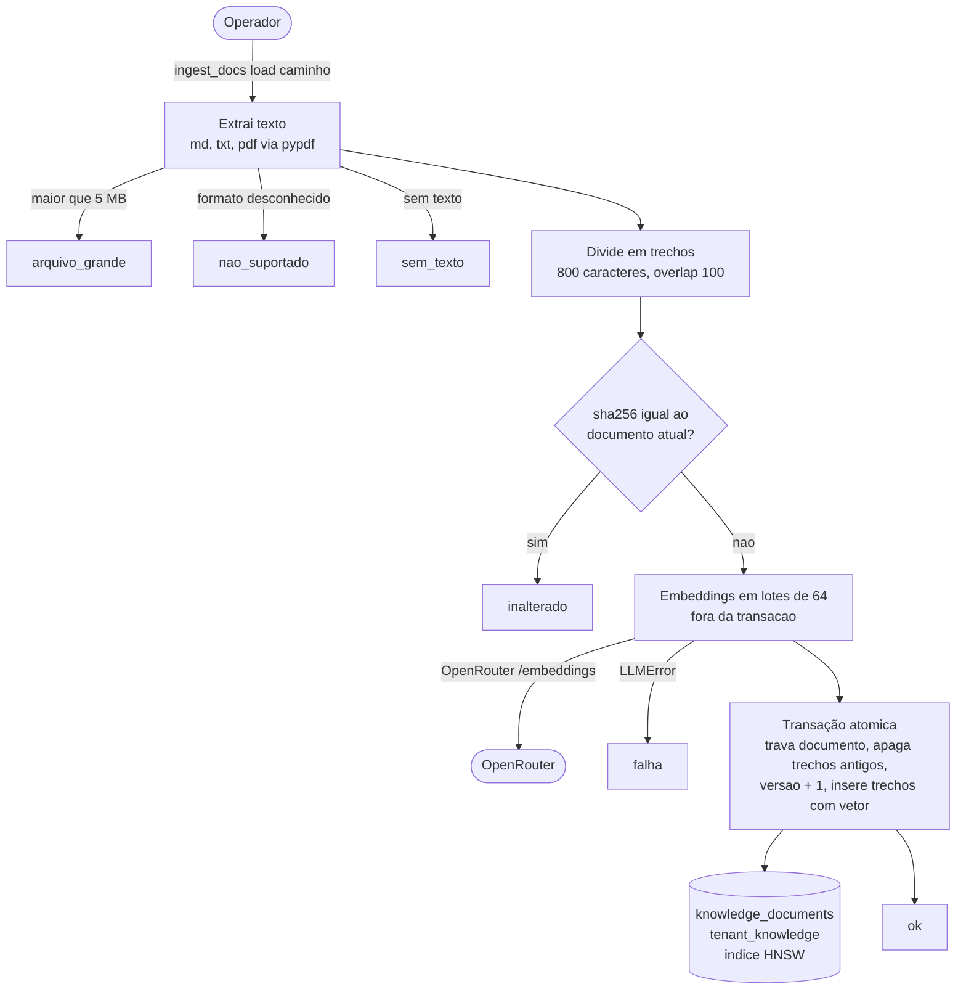
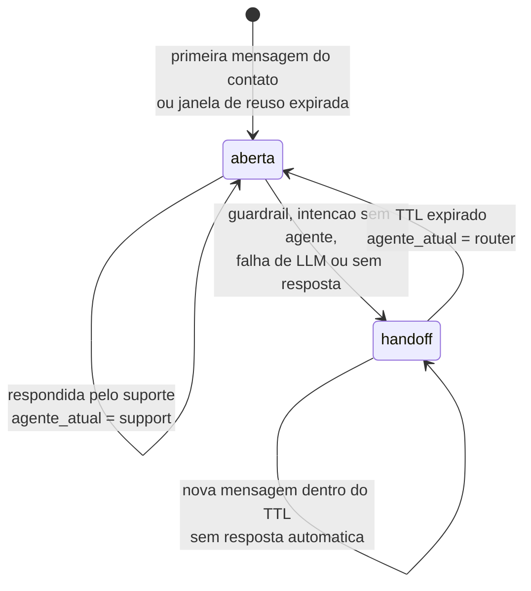
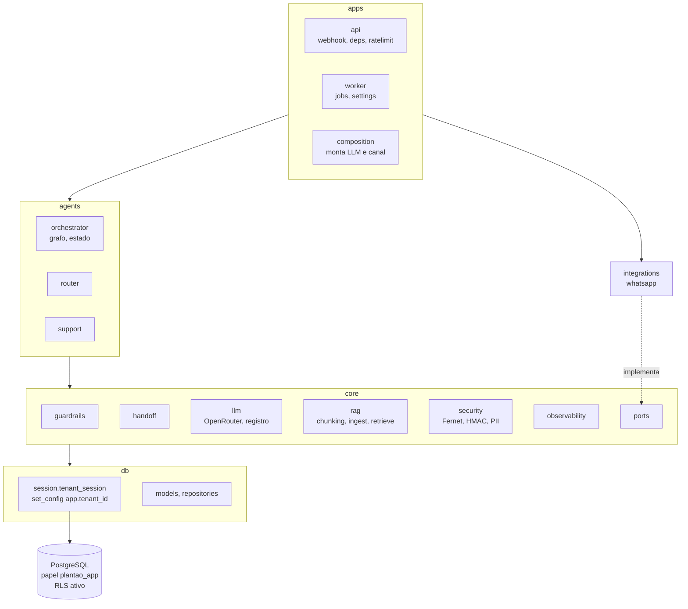
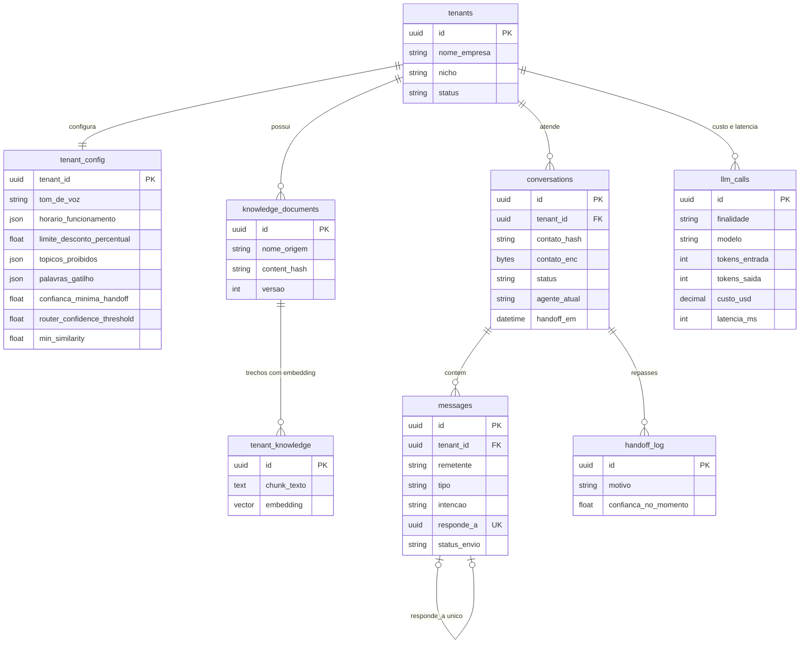

# Plantão.AI — Núcleo de Agentes de IA (Agentic Ops as a Service)

> Implementação técnica da ideia detalhada em [Projeto_Empresa_Autonoma.md](../Projeto_Empresa_Autonoma.md) (seções 7 a 9) e no [Plano_de_Estudos.md](../Plano_de_Estudos.md) (Módulo 11 — Capstone).

"A equipe de IA que fica de plantão pelo seu negócio — 24 horas por dia, 7 dias por semana."

## O que é

Núcleo multi-tenant de agentes de IA que atendem clientes finais de pequenas e médias empresas via WhatsApp. No estado atual (Sprint 2, feature `001-router-support-agent`) o fluxo é:

```
WhatsApp -> webhook (FastAPI) -> fila (arq/Redis) -> worker
         -> guardrails de entrada -> Roteador -> Suporte (RAG) -> guardrails de saída
         -> resposta ao cliente OU handoff para humano
```

- **Roteador** classifica a intenção da mensagem.
- **Suporte** responde apenas com base nos documentos do tenant (RAG com pgvector), cita os trechos usados e calcula a confiança; abaixo do limiar, faz handoff.
- **Guardrails** (entrada e saída) cobrem PII, injeção de prompt, valores não fundamentados, promessas proibidas e limite de desconto.
- **Multi-tenancy** com Row-Level Security no Postgres (papel `plantao_app`, sem superusuário).
- **PII** criptografada em repouso (Fernet) e mascarada nos logs.

Especificação, plano, contratos e tarefas ficam em [specs/001-router-support-agent/](specs/001-router-support-agent/). Os princípios de engenharia estão em [.specify/memory/constitution.md](.specify/memory/constitution.md) e as decisões de arquitetura em [docs/adr/](docs/adr/).

## Stack

| Camada | Tecnologia |
|---|---|
| Linguagem | Python 3.11+ (type hints, mypy estrito) |
| API | FastAPI (async) |
| Orquestração | LangGraph |
| LLM | OpenRouter (gateway) |
| Banco | PostgreSQL 16 + pgvector, SQLAlchemy 2 async, Alembic |
| Fila / cache | Redis + arq |
| WhatsApp (MVP) | Evolution API (self-hosted) |

## Camadas (verificadas por import-linter)

```
apps  >  agents  >  core  >  db
```

- `apps/` — API (webhook, health) e worker (job `processar_mensagem`).
- `agents/` — `router/`, `support/` e `orchestrator/` (grafo).
- `core/` — config, guardrails, handoff, llm, observability, ports, rag, security.
- `integrations/` — adaptadores externos (WhatsApp).
- `db/` — modelos, sessão com RLS, repositórios e migrações.
- `scripts/` — `tenants` (onboarding e ciclo de vida das empresas), `ingest_docs`, `run_evals`.

## Arquitetura e funcionamento

Os diagramas abaixo descrevem o estado atual do código (Sprint 2). Eles usam [Mermaid](https://mermaid.js.org/), renderizado nativamente pelo GitHub e pelo VS Code (extensão Markdown Preview Mermaid Support).

### 1. Visão geral e integrações

O cliente final fala com a Evolution API, que entrega a mensagem à API do Plantão.AI por webhook. A API só valida, persiste e enfileira; todo o trabalho com LLM acontece no worker. O OpenRouter é o único caminho para modelos (chat e embeddings). A Evolution API é o único canal de saída para o WhatsApp.



| Sistema | Papel | Configuração |
|---|---|---|
| Evolution API | Recebe e envia mensagens do WhatsApp. Envio por `POST /message/sendText/{instancia}` com header `apikey`. Uma instância por empresa; a chave de envio e o segredo de entrega ficam em `channel_credentials`, cadastrados pelo onboarding (nunca em variável global). | `WHATSAPP_BASE_URL` |
| OpenRouter | Chat (`/chat/completions`, JSON, temperatura 0) e embeddings (`/embeddings`). Timeout de 15 s e 1 retry com backoff de 1 s, só em erro de rede, timeout ou 5xx. | `OPENROUTER_API_KEY`, `MODEL_CHEAP`, `MODEL_STRONG`, `EMBEDDING_MODEL` |
| Redis | Fila do arq e contador de rate limit por empresa (`rl:{tenant_id}:{minuto}`, expira em 90 s; limite vem de `tenant_config.limite_mensagens_por_minuto`). | `REDIS_URL` |
| PostgreSQL | Dados dos tenants, conversas, base de conhecimento (pgvector, índice HNSW) e custo de LLM. Acesso pelo papel `plantao_app`, com RLS. | `DATABASE_URL`, `DATABASE_ADMIN_URL` |
| LangSmith | Traces, ligado só se houver chave. | `LANGSMITH_API_KEY`, `LANGSMITH_PROJECT` |

Nesta entrega o repasse humano consiste em avisar o cliente, marcar a conversa como `handoff` e registrar o motivo em `handoff_log`. Não há fila nem painel de atendentes (Sprint 5).

### 2. Ciclo de vida de uma mensagem

A API responde ao webhook em milissegundos, sem chamar LLM. O worker executa em quatro fases e nunca segura uma transação de banco durante chamadas externas. A idempotência vem de dois pontos: `external_id` único na entrada e índice único em `messages.responde_a` na saída, mais o `_job_id` igual ao id da mensagem no arq.



Códigos de retorno do job: `respondida`, `handoff`, `ja_respondida`, `handoff_ativo` e `mensagem_inexistente`. Se o envio falha, a resposta fica gravada com `status_envio = falha`.

### 3. Orquestrador de agentes (LangGraph)

O grafo tem cinco nós em série. Qualquer nó pode encerrar o fluxo com uma decisão de `handoff`, e nenhuma resposta chega ao cliente sem passar pelos guardrails de saída. Os textos enviados em handoff são fixos, sem LLM. O Roteador e o Suporte são independentes entre si (contrato do import-linter) e só se comunicam pelo estado do grafo.



| Agente ou nó | Modelo | O que faz |
|---|---|---|
| Guardrails de entrada | nenhum | Reprova mensagem não textual (áudio, imagem), vazia ou só com emoji, e mensagem com palavra-gatilho do tenant (ex.: "procon", "advogado"). |
| Roteador | `MODEL_CHEAP` | Classifica a intenção em `suporte`, `venda`, `agendamento`, `cobranca` ou `outro`, com confiança e intenções secundárias. Usa as últimas 6 mensagens. Confiança abaixo do limiar do tenant é tratada como `suporte`. |
| Suporte | `MODEL_STRONG` + embeddings | Busca até 4 trechos do tenant com similaridade mínima, responde só com base neles, cita os trechos usados (máx. 600 caracteres) e informa a confiança. A confiança final é o menor valor entre a do LLM e a derivada da similaridade (linear de 0,30 a 0,60). |
| Guardrails de saída | nenhum | Em ordem: confiança mínima, tópico proibido, desconto acima do limite e valor (dinheiro, percentual, horário) que não aparece nos trechos recuperados. |

### 4. Ingestão da base de conhecimento

O operador carrega os documentos do tenant pela CLI. Os embeddings são calculados fora da transação e a troca de versão é atômica: o documento novo entra inteiro ou o anterior permanece. O conteúdo do arquivo é tratado só como dado e nunca é registrado em logs.



### 5. Estados da conversa

Uma conversa em `handoff` não recebe resposta automática até `HANDOFF_TTL_MINUTES` após o repasse ou a última mensagem humana. Depois disso volta a `aberta` e o Roteador assume de novo. Mensagens do mesmo contato dentro de `CONVERSATION_REUSE_HOURS` reaproveitam a conversa.



Motivos gravados em `handoff_log.motivo`:

| Motivo | Origem |
|---|---|
| `nao_texto`, `mensagem_vazia`, `palavra_gatilho:<termo>` | Guardrails de entrada |
| `intencao_sem_agente:<intencao>` | Roteador (venda, agendamento, cobrança, outro) |
| `sem_resposta_na_base` | Suporte (nenhum trecho acima da similaridade mínima, ou o modelo declarou não saber) |
| `falha_llm`, `falha_embedding` | Erro, timeout ou JSON inválido do OpenRouter após o retry |
| `confianca_abaixo_do_minimo`, `topico_proibido:<termo>`, `desconto_acima_do_limite`, `valor_nao_fundamentado:<valor>` | Guardrails de saída |

### 6. Camadas, segurança e multi-tenancy

As dependências só apontam para baixo (`apps > agents > core > db`), e `core` nunca importa `agents`, `apps` ou `integrations`. O import-linter reprova o build se isso mudar. O canal WhatsApp implementa a porta `MessageChannel` definida em `core/ports`, então trocar de provedor não toca no núcleo.



- **Isolamento por tenant.** Todo acesso a dados passa por `tenant_session`, que define `app.tenant_id` na transação. As políticas de RLS do Postgres filtram as linhas por esse valor, e sem tenant definido a consulta devolve zero linhas. A aplicação conecta com o papel `plantao_app` (sem superusuário e sem `BYPASSRLS`). O papel administrativo (`DATABASE_ADMIN_URL`) ignora RLS e só é usado por `scripts/tenants.py` (operações entre empresas: criar, listar, mudar estado, apagar).
- **PII.** O telefone do contato é guardado criptografado (Fernet, `PII_ENCRYPTION_KEY`) e com hash HMAC (`PII_HASH_KEY`) para localizar a conversa. Os logs são JSON, mascaram telefone e mensagem e nunca registram o payload do webhook nem credenciais.
- **Resolução da empresa e autenticação do webhook.** A empresa é identificada pela **conexão de canal** (`channel_connections`, diretório de roteamento por `instance_name`). O header `X-Webhook-Token` é comparado em tempo constante com o `webhook_secret_hash` **daquela conexão**; instância desconhecida, sem token e token errado devolvem o mesmo 401. Não existe mais segredo global nem tenant fixo.
- **Ciclo de vida.** Cada empresa tem estado `em_configuracao`, `ativo`, `suspenso` ou `encerrado`, lido do banco a cada mensagem (sem cache). Suspensão e reativação valem em até 1 minuto, inclusive para jobs já na fila.
- **Observabilidade.** Cada chamada ao OpenRouter grava uma linha em `llm_calls` (finalidade, modelo, tokens, custo em USD, latência e erro), inclusive as que falham. Os logs carregam `correlation_id`, `tenant_id` e `conversation_id`. Mudanças de configuração, estado, conexão e exclusão de dados vão para `audit_log` (campo, valor anterior, valor novo, operador, data), sem segredos.

### 7. Modelo de dados

O diagrama mostra as tabelas usadas no Sprint 2 e as colunas principais. As tabelas `leads`, `appointments`, `billing_events` e `usage_metrics` existem desde o Sprint 1, mas só serão usadas nos sprints seguintes. Todas as tabelas com dados de tenant têm RLS.



## Como rodar localmente

Todos os comandos a partir de `plantao-ai/`.

### 1. Infraestrutura e dependências

```powershell
docker compose up -d
python -m venv .venv
.venv\Scripts\Activate.ps1
pip install -r requirements-dev.txt
```

### 2. Variáveis de ambiente

```powershell
Copy-Item .env.example .env
```

Preencha no `.env`:

| Variável | Observação |
|---|---|
| `DATABASE_URL` | Usa o papel `plantao_app` (sujeito a RLS) |
| `DATABASE_ADMIN_URL` | Superusuário, só para `scripts/` (migrações e CLI de operador) |
| `APP_DB_PASSWORD` | Senha do papel `plantao_app` criado pela migração |
| `OPENROUTER_API_KEY` | Chave do OpenRouter |
| `PII_ENCRYPTION_KEY` | Chave Fernet (`python -c "from cryptography.fernet import Fernet; print(Fernet.generate_key().decode())"`) |
| `PII_HASH_KEY` | Segredo para o hash de contatos |
| `WHATSAPP_BASE_URL` | Evolution API (a instância, a chave de envio e o segredo de entrega são por empresa, cadastrados pelo onboarding) |
| `PURGE_DRENAGEM_SEGUNDOS` | Espera mínima entre encerrar e apagar os dados de uma empresa (padrão 120) |

Não existem mais `PILOT_TENANT_ID` nem `WHATSAPP_WEBHOOK_SECRET`: cada empresa tem sua própria conexão e credenciais (ver passo 4).

### 3. Migrações

```powershell
alembic upgrade head
```

### 4. Onboarding de uma empresa

Não existe mais seed de tenant único: cada empresa entra por um arquivo de onboarding (esquema em
[specs/002-multitenancy/contracts/onboarding-file.md](specs/002-multitenancy/contracts/onboarding-file.md),
exemplos em [docs/exemplos/](docs/exemplos/)). As credenciais entram por **nome de variável de ambiente**, nunca
no arquivo nem na saída do comando.

```powershell
$env:MINHA_CLINICA_API_KEY = "..."
$env:MINHA_CLINICA_WEBHOOK_SECRET = "..."
python -m scripts.tenants create --file docs\exemplos\empresa-modelo.yml --operador rafael
python -m scripts.tenants readiness minha-clinica --operador rafael
python -m scripts.tenants test minha-clinica --file docs\exemplos\empresa-modelo.yml --operador rafael
python -m scripts.tenants activate minha-clinica --operador rafael

python -m scripts.ingest_docs load --tenant minha-clinica tests\evals\docs_piloto
python -m scripts.ingest_docs list --tenant minha-clinica
python -m scripts.ingest_docs remove --tenant minha-clinica faq_clinica.md --yes
```

Ciclo de vida completo (suspender, reativar, encerrar, apagar) e configuração por empresa:

```powershell
python -m scripts.tenants suspend minha-clinica --operador rafael --motivo "incidente"
python -m scripts.tenants resume minha-clinica --operador rafael
python -m scripts.tenants config set minha-clinica --operador rafael limite_desconto_percentual=5
python -m scripts.tenants audit minha-clinica
python -m scripts.tenants close minha-clinica --operador rafael
python -m scripts.tenants purge minha-clinica --operador rafael --confirmar "Nome exato da empresa"
```

Todos os comandos (e os alvos equivalentes `make tenant-*`) estão documentados em
[specs/002-multitenancy/contracts/tenants-cli.md](specs/002-multitenancy/contracts/tenants-cli.md).

### 5. API e worker

```powershell
uvicorn apps.api.main:app --reload
arq apps.worker.settings.WorkerSettings
```

`GET /health` responde na porta 8000. O webhook é `POST /webhooks/whatsapp` com o token configurado.

### Painel de operação

```powershell
make painel-seed     # empresas e histórico de demonstração
make painel-dev      # API com login de desenvolvimento
make worker          # em outro terminal: alimenta os números do painel
```

Abra `http://localhost:8000/painel/`. Visão geral, ficha de cada empresa, mudança de estado e cadastro/edição ficam na
mesma tela, com o design system do projeto (`design-system/`). O front-end é estático (`apps/dashboard/web/`, sem build) e
os testes dele rodam com `make test-web`. Em produção o login é por OIDC e a lista de operadores vem de `OPERADORES`
(ver o [runbook](docs/RUNBOOK_OPERACIONAL.md#13-painel-de-operação-spec-004)). Especificação, plano e contratos em
[specs/004-admin-dashboard](specs/004-admin-dashboard/spec.md).

O passo a passo completo do multi-tenancy (onboarding, isolamento entre empresas, suspensão e exclusão) está em
[specs/002-multitenancy/quickstart.md](specs/002-multitenancy/quickstart.md); o fluxo original de roteador e
suporte, em [specs/001-router-support-agent/quickstart.md](specs/001-router-support-agent/quickstart.md).

## Qualidade

```powershell
ruff check . ; ruff format --check .
mypy
lint-imports
pytest --cov
pip-audit
```

- Os testes de integração exigem o Postgres e o Redis do `docker compose`. O banco `plantao_test` é recriado a cada sessão.
- Gate de cobertura: 80% no total e 100% em `core/guardrails` (`coverage report --include="core/guardrails/*" --fail-under=100`).
- Suíte adversarial: `pytest tests/adversarial`.
- Atalhos: `make help` lista os comandos do [Makefile](Makefile) (`make check` roda todos os gates).
- Hooks: `pre-commit install -c plantao-ai/.pre-commit-config.yaml` (a partir da raiz do repositório). O CI está em `.github/workflows/ci.yml` na raiz.

## Avaliação com LLM real

As suítes em `tests/evals/` medem as metas do spec (acerto de roteamento, groundedness, handoff, adversarial, latência e custo). Exigem `OPENROUTER_API_KEY` e consomem créditos:

```powershell
python -m scripts.run_evals --suite todas
```

Resultados e limitações do Sprint 2: [docs/SPRINT_2_RESULTADOS.md](docs/SPRINT_2_RESULTADOS.md).

## Roadmap

| Sprint | Entrega |
|:---:|---|
| 1 | Fundação: repositório, Postgres + pgvector, FastAPI, webhook WhatsApp (eco) |
| 2 | Agente Roteador + Agente de Suporte com RAG, guardrails, handoff (1 tenant piloto) |
| 3 | Multi-tenancy real: resolução por conexão, onboarding repetível, ciclo de vida, isolamento comprovado |
| 4 | Agente Agendador (Google Calendar) |
| 5 | Agente SDR + guardrails ampliados |
| 6 | Observabilidade (LangSmith) + cobrança recorrente |

Histórico: [docs/SPRINT_1_PLAN.md](docs/SPRINT_1_PLAN.md), [docs/SPRINT_2_RESULTADOS.md](docs/SPRINT_2_RESULTADOS.md).
