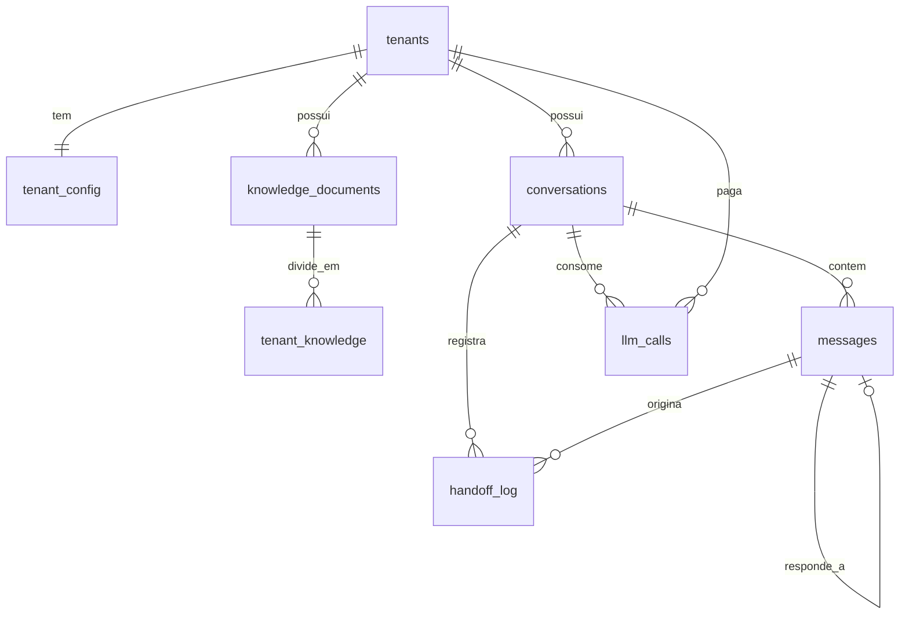

# Data Model: Agente Roteador e Agente de Suporte

Baseado em `db/models.py` (Sprint 1) e na seção 8.3 de `Projeto_Empresa_Autonoma.md`. As mudanças chegam por
Alembic: **0001** baseline do schema atual, **0002** alterações abaixo, **0003** papel `plantao_app` e RLS.
Toda migração tem `downgrade` testado.

Convenções: `PK` chave primária, `FK` chave estrangeira, `tenant_id` sempre `NOT NULL` com índice. Todas as
tabelas abaixo (exceto `tenants`) têm RLS por `tenant_id`.

## Entidades alteradas

### tenants (sem mudança de colunas)

RLS por `id = current_setting('app.tenant_id')::uuid`.

### tenant_config (ALTERADA)

| Coluna | Tipo | Observação |
|---|---|---|
| tenant_id | uuid PK, FK | existente |
| tom_de_voz | text | existente |
| horario_funcionamento | json | existente |
| limite_desconto_percentual | float | existente; o suporte nunca oferece desconto, limite usado só para bloquear |
| topicos_proibidos | json (lista) | existente |
| confianca_minima_handoff | float | existente, padrão 0,7 |
| **palavras_gatilho** | json (lista) | NOVA. Padrão: `["processo","procon","cancelar tudo","advogado","reclamação"]` (FR-008) |
| **router_confidence_threshold** | float | NOVA, padrão 0,6 (FR-002) |
| **min_similarity** | float | NOVA, padrão 0,30 (R-07) |

### conversations (ALTERADA)

| Coluna | Tipo | Observação |
|---|---|---|
| id | uuid PK | existente |
| tenant_id | uuid FK | existente |
| canal | string(50) | existente (`whatsapp`) |
| ~~contato_id~~ | — | REMOVIDA (telefone em texto) |
| **contato_hash** | string(64) | HMAC-SHA256 do contato; usado para localizar a conversa |
| **contato_enc** | text | Fernet do contato; usado para enviar resposta |
| status | string(50) | `aberta` \| `handoff` \| `resolvida` |
| agente_atual | string(50) | `router` \| `support` \| `humano` |
| **ultima_atividade_em** | timestamptz | atualizada a cada mensagem; base do TTL (R-04) |
| **handoff_em** | timestamptz null | início do handoff |
| iniciado_em | timestamptz | existente |

Índice: `(tenant_id, canal, contato_hash, ultima_atividade_em DESC)`.

### messages (ALTERADA)

| Coluna | Tipo | Observação |
|---|---|---|
| id | uuid PK | existente |
| **tenant_id** | uuid FK | NOVA (corrige violação do princípio III) |
| conversation_id | uuid FK | existente |
| remetente | string(20) | `lead` \| `agente` \| `humano` |
| conteudo | text | existente; vazio para mensagens não textuais |
| **tipo** | string(20) | `texto` \| `nao_texto` (FR-014) |
| **external_id** | string(128) null | id da mensagem no provedor; NULL para mensagens do agente |
| **intencao** | string(20) null | só para `lead`: venda, suporte, agendamento, cobranca, outro |
| **intencao_confianca** | float null | confiança do roteador |
| **intencoes_secundarias** | json null | lista de intenções secundárias |
| **status_envio** | string(20) null | só para `agente`: `pendente` \| `enviada` \| `falha` |
| **responde_a** | uuid FK null | mensagem do lead que originou a resposta (garante 1 resposta por mensagem) |
| timestamp | timestamptz | existente |

Restrições: `UNIQUE (tenant_id, external_id) WHERE external_id IS NOT NULL` (FR-015) e
`UNIQUE (responde_a) WHERE responde_a IS NOT NULL` (SC-008).

### handoff_log (ALTERADA)

| Coluna | Tipo | Observação |
|---|---|---|
| id | uuid PK | existente |
| **tenant_id** | uuid FK | NOVA |
| conversation_id | uuid FK | existente |
| **message_id** | uuid FK null | mensagem do lead que causou o repasse |
| motivo | text | código padronizado (ver abaixo) |
| confianca_no_momento | float | existente; 0 quando não se aplica |
| resolvido_por_humano | bool | existente |
| criado_em | timestamptz | existente |

Códigos de motivo (`motivo`): `palavra_gatilho:<termo>`, `nao_texto`, `mensagem_vazia`,
`intencao_sem_agente:<intencao>`, `sem_resposta_na_base`, `resposta_nao_fundamentada`,
`confianca_abaixo_do_minimo`, `topico_proibido:<termo>`, `valor_nao_fundamentado:<valor>`,
`desconto_acima_do_limite`, `falha_llm`, `falha_embedding`.

### tenant_knowledge (ALTERADA)

| Coluna | Tipo | Observação |
|---|---|---|
| id | uuid PK | existente |
| tenant_id | uuid FK | existente |
| **documento_id** | uuid FK | NOVA, referencia `knowledge_documents.id` com `ON DELETE CASCADE` |
| documento_origem | string(255) | existente (mantida como cópia legível) |
| **chunk_indice** | int | NOVA, posição do trecho no documento |
| chunk_texto | text | existente |
| embedding | vector(1536) | existente; índice HNSW `vector_cosine_ops` |
| criado_em | timestamptz | existente |

## Entidades novas

### knowledge_documents

| Coluna | Tipo | Observação |
|---|---|---|
| id | uuid PK | |
| tenant_id | uuid FK | |
| nome_origem | string(255) | nome do arquivo; único por tenant |
| content_hash | string(64) | SHA-256 do conteúdo; recarga sem mudança é ignorada |
| versao | int | incrementa a cada recarga |
| num_trechos | int | informado ao operador (FR-011) |
| criado_em / atualizado_em | timestamptz | |

Restrição: `UNIQUE (tenant_id, nome_origem)`.

### llm_calls

| Coluna | Tipo | Observação |
|---|---|---|
| id | uuid PK | |
| tenant_id | uuid FK | |
| conversation_id | uuid FK null | NULL em ingestão de documentos |
| message_id | uuid FK null | |
| finalidade | string(20) | `roteador` \| `suporte` \| `embedding` |
| modelo | string(100) | |
| tokens_entrada / tokens_saida | int | |
| custo_usd | numeric(12,6) | do gateway; senão tabela estática |
| latencia_ms | int | |
| sucesso | bool | |
| erro | text null | só código/tipo do erro, sem conteúdo do cliente |
| criado_em | timestamptz | |

Atende FR-017 e SC-007. A tabela diária `usage_metrics` (Sprint 1) continua existindo e será alimentada por
agregação no Sprint 6.

## Relacionamentos

## Transições de estado

**Conversa**: `aberta` → `handoff` (qualquer motivo da lista acima) → `aberta` (após TTL sem atividade humana,
R-04). `resolvida` não é usada neste sprint.

**Mensagem do agente**: `pendente` → `enviada` | `falha`.

## Regras de validação

- Todo acesso passa por `tenant_session(tenant_id)`; sem `app.tenant_id` as consultas retornam zero linhas
  (RLS).
- `contato_enc` e `contato_hash` são sempre gravados juntos; texto puro do telefone nunca vai ao banco, à fila
  ou aos logs.
- `chunk_texto` não vazio; `embedding` com 1 536 dimensões.
- `external_id` obrigatório para mensagens `lead`.
- Valores de `intencao` limitados ao enum do roteador.
