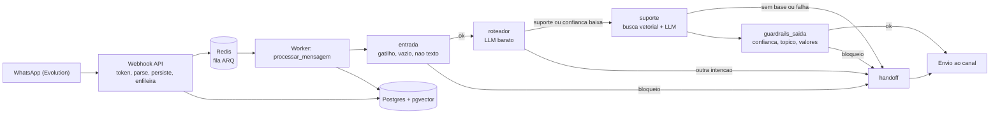

# Implementation Plan: Agente Roteador e Agente de Suporte com Base de Conhecimento

**Branch**: `001-router-support-agent` | **Date**: 2026-10-04 | **Spec**: [spec.md](spec.md)

**Input**: Feature specification from `/specs/001-router-support-agent/spec.md`

## Summary

Entregar o primeiro fluxo de IA ponta a ponta do Plantão.AI para uma empresa piloto: o webhook do WhatsApp
persiste e enfileira a mensagem; um worker assíncrono executa um grafo LangGraph com guardrails de entrada
(determinísticos), Agente Roteador (LLM barato), Agente de Suporte (busca vetorial + LLM) e guardrails de
saída; a resposta é enviada pelo canal ou a conversa é repassada ao humano com motivo registrado.

Abordagem técnica (detalhes em [research.md](research.md)):

- Pipeline em duas etapas: **webhook rápido** (valida, persiste, enfileira em Redis com ARQ) e **worker** (grafo).
- **Falha segura por construção**: qualquer dúvida, erro, baixa confiança ou valor não fundamentado vira handoff.
- **Isolamento já no Sprint 2**: `tenant_id` em todas as tabelas, RLS com papel de banco sem superusuário e teste
  com dois tenants, mesmo havendo um só tenant em produção (FR-021).
- **Camada única de LLM** (`core/llm`) via OpenRouter, com custo, tokens e latência gravados por chamada.
- **Correção da regra de dependência**: o grafo do orquestrador sai de `core/` (que não pode importar `agents/`)
  e passa a viver em `agents/orchestrator/` (ADR-0001, a criar em FQ-6).
- **Fundação de qualidade** exigida pela constituição (pyproject, mypy estrito, import-linter, pre-commit, CI).

## Technical Context

**Language/Version**: Python 3.11 (venv atual 3.11.7)

**Primary Dependencies**: FastAPI, SQLAlchemy 2 async + asyncpg, pgvector, Alembic, LangGraph, pydantic v2 +
pydantic-settings, httpx. **Novas** (justificadas em [research.md](research.md) R-02, R-06, R-08): `arq`
(fila async sobre Redis), `cryptography` (Fernet para PII), `pypdf` (extração de PDF).
Dev: `pytest-asyncio`, `pytest-cov`, `mypy`, `import-linter`, `pip-audit`, `pip-tools`, `pre-commit`, `fakeredis`.

**Storage**: PostgreSQL 16 + pgvector (relacional + vetores, HNSW cosseno); Redis 7 (fila e rate limit).

**Testing**: pytest + pytest-asyncio. Unitários sem rede (LLM fake); integração com Postgres/Redis do
docker-compose; contrato para `integrations/whatsapp`; adversariais em `tests/adversarial/`; avaliação com LLM
real em `scripts/run_evals.py` (manual, fora do CI).

**Target Platform**: Linux server (Railway/Render) em produção; Windows + Docker Desktop em desenvolvimento.

**Project Type**: web-service (API + worker) em monorepo modular; sem frontend.

**Performance Goals**: resposta ao cliente ≤ 10 s em 90% das mensagens de suporte (SC-004); webhook responde
200 em < 500 ms (FR-016).

**Constraints**: custo médio < US$ 0,01 por conversa de suporte (SC-006); LLM só via OpenRouter; webhook nunca
espera LLM; PII mascarada em logs; timeout de LLM 15 s com 1 retry; 1 tenant piloto.

**Scale/Scope**: 1 tenant, ~100 conversas/dia, base de ~50 documentos (~2 000 trechos). Dimensionamento além
disso fica para o Sprint 3.

## Constitution Check

*GATE: Must pass before Phase 0 research. Re-check after Phase 1 design.*

Avaliação contra `.specify/memory/constitution.md` v1.0.0. Os gates II, III, IV, V e VII são bloqueantes.

| Princípio | Gate | Situação | Como o plano atende |
|---|---|---|---|
| I. Stack | Python 3.11 tipado; mypy estrito em `core/`, `agents/`, `db/`; LLM só por `core/llm`; ruff, pytest, pre-commit; deps fixadas e auditadas | PASS com ação | Fundação de qualidade (FQ-1 a FQ-6); lockfile por `pip-compile` (R-14); `pip-audit` no CI |
| II. Modularidade | Regra de dependência imposta no CI; sem estado global; DI; agentes isolados; webhook não espera LLM; worker idempotente | PASS com correção | `core/orchestrator` importa `agents/` hoje (violação). Movido para `agents/orchestrator/` (ADR-0001). Contratos import-linter. Idempotência por unique `(tenant_id, external_id)` |
| III. Multi-tenancy | `tenant_id NOT NULL`; RLS; tenant por sessão; RAG/logs isolados; teste com 2 tenants | PASS com correção | `messages` e `handoff_log` não têm `tenant_id` hoje: migração 0002 adiciona. Papel `plantao_app` sem superusuário e `FORCE ROW LEVEL SECURITY`. `SET LOCAL app.tenant_id` por transação. Teste de isolamento obrigatório |
| IV. Segurança/LGPD | Segredos por env; validação; token no webhook; rate limit por tenant; PII criptografada e mascarada; opt-in; prompt injection | PASS com ação | Header `X-Webhook-Token` (hoje ausente). Telefone: HMAC para busca + Fernet para envio. Máscara em logs. Rate limit Redis por tenant. Opt-in: N/A neste sprint (contato iniciado pelo cliente final; sem disparo ativo). Delimitação de conteúdo não confiável e casos adversariais |
| V. Guardrails | Todo envio passa por `core/guardrails`; sem inventar valores; humano em ações críticas; testes adversariais test-first | PASS | Guardrail de entrada (gatilhos, vazio, não texto) antes de qualquer LLM. Guardrail de saída com checagem de fundamentação de valores e limite de desconto. 100% de cobertura |
| VI. SDD/Qualidade | Spec aprovada; cobertura 80% / 100% guardrails; DoD; Alembic reversível | PASS com ação | Spec em `specs/001-...`. Alembic ainda não inicializado: baseline 0001 + 0002 + 0003 com `downgrade` |
| VII. Observabilidade | JSON com `correlation_id`, `tenant_id`, `conversation_id`; custo por chamada de LLM; orçamento e alerta; métricas-chave | PASS parcial | Tabela `llm_calls` por chamada (modelo, tokens, custo, latência). Log JSON com contexto. Orçamento/alerta por tenant fica para o Sprint 6 (ver Complexity Tracking) |
| VIII. Simplicidade | YAGNI; sem microserviços; só LangGraph; nova dependência justificada | PASS | API + worker no mesmo repositório; 3 novas dependências justificadas; chunking com `langchain-text-splitters` (já instalado via langchain) |

**Re-avaliação pós-design (Phase 1)**: PASS em todos os gates. As correções de III (`tenant_id` em `messages` e
`handoff_log`) e II (orquestrador) estão refletidas em [data-model.md](data-model.md) e na estrutura abaixo.

## Project Structure

### Documentation (this feature)

```text
specs/001-router-support-agent/
├── plan.md                         # Este arquivo
├── research.md                     # Phase 0
├── data-model.md                   # Phase 1
├── quickstart.md                   # Phase 1
├── contracts/
│   ├── whatsapp-webhook.md         # Contrato de entrada (HTTP) e porta de saída
│   ├── knowledge-cli.md            # Contrato do CLI de ingestão
│   └── llm-contracts.md            # Portas internas e saídas estruturadas dos LLMs
├── checklists/requirements.md
└── tasks.md                        # Phase 2 (/speckit.tasks, não criado aqui)
```

### Source Code (repository root: `plantao-ai/`)

```text
apps/
├── api/
│   ├── main.py
│   ├── deps.py                      # NOVO: injeção de sessão por tenant, fila, canal
│   ├── routes/health.py
│   └── webhooks/whatsapp.py         # ALTERADO: token, persistência, enfileiramento
└── worker/
    ├── settings.py                  # NOVO: WorkerSettings do ARQ
    └── jobs.py                      # NOVO: processar_mensagem (liga grafo, DB e canal)
agents/
├── orchestrator/                    # MOVIDO de core/orchestrator
│   ├── graph.py                     # nós: entrada, roteador, suporte, guardrails_saida, handoff
│   └── state.py                     # estado pydantic
├── router/{agent.py,prompts/,schemas.py}
└── support/{agent.py,prompts/,schemas.py}
core/
├── llm/{ports.py,openrouter.py,pricing.py}       # NOVO: única porta para LLM e embeddings
├── rag/{chunking.py,ingest.py,retrieve.py}       # NOVO: ingestão e busca por tenant
├── guardrails/{input_checks.py,output_checks.py} # checks.py dividido e estendido
├── ports/channel.py                              # NOVO: Protocol MessageChannel
├── security/{crypto.py,pii.py}                   # NOVO: Fernet, HMAC, máscara
├── observability/logging.py                      # ALTERADO: JSON + contexto + máscara
└── config.py                                     # ALTERADO: novos settings
db/
├── models.py                        # ALTERADO (ver data-model.md)
├── session.py                       # ALTERADO: tenant_session()
└── migrations/                      # NOVO: Alembic (0001 baseline, 0002 sprint2, 0003 rls)
integrations/whatsapp/client.py      # implementa MessageChannel; parse de payload
scripts/
├── ingest_docs.py                   # NOVO (contrato em contracts/knowledge-cli.md)
├── run_evals.py                     # NOVO: avaliação com LLM real (manual)
└── seed_tenant.py                   # ALTERADO: config completa do piloto
tests/
├── unit/                            # guardrails, router, support, chunking, crypto, pii
├── integration/                     # RLS e isolamento (2 tenants), idempotência, pipeline
├── contract/                        # parse_inbound e send_text do canal
├── adversarial/                     # 20 casos (SC-003)
└── evals/                           # datasets YAML, documentos e payloads do piloto
docs/adr/0001-orquestrador-em-agents.md, 0002-fila-arq.md
pyproject.toml  .pre-commit-config.yaml  .github/workflows/ci.yml  requirements.lock
```

**Structure Decision**: manter o monorepo modular existente (sem novos diretórios de topo). O único movimento
estrutural é `core/orchestrator` → `agents/orchestrator`, necessário para cumprir a regra de dependência do
princípio II. Contratos import-linter: (1) camadas `apps > agents > core > db`; (2) `core` proibido de importar
`agents`, `apps`, `integrations`; (3) `agents` proibido de importar `apps`; (4) agentes irmãos (`router`,
`support`) independentes entre si; só `orchestrator` os compõe.

### Fluxo de processamento



## Fundação de qualidade (pré-requisito da constituição)

| ID | Entrega | Gate que habilita |
|---|---|---|
| FQ-1 | `pyproject.toml`: ruff, mypy estrito (`core`, `agents`, `db`), pytest-asyncio, coverage (80% / 100% guardrails) | I, VI |
| FQ-2 | `import-linter` com os 4 contratos acima | II |
| FQ-3 | `.pre-commit-config.yaml`: ruff, gitleaks, mypy | I, IV |
| FQ-4 | `.github/workflows/ci.yml`: ruff, mypy, lint-imports, pytest com cobertura, pip-audit, gitleaks | VI |
| FQ-5 | Alembic inicializado, baseline 0001 reproduzindo o schema do Sprint 1 | VI |
| FQ-6 | `docs/adr/0001-orquestrador-em-agents.md` e `0002-fila-arq.md` | VIII |

## Complexity Tracking

> Preencher apenas para violações de gate que precisam de justificativa.

| Violação | Por que é necessária | Alternativa mais simples rejeitada porque |
|---|---|---|
| Orçamento de custo por tenant com alerta (VII) fica fora deste sprint | Spec do Sprint 2 limita escopo a registro de uso (FR-017); painel e alerta são Sprint 6 | Implementar já exigiria agregação, limites e canal de alerta, sem segundo tenant que justifique. Mitigação: rate limit por tenant e `llm_calls` já gravam custo |
| Camada de fila (ARQ + Redis) | Princípio II e FR-016 exigem webhook sem esperar LLM | Processar no request quebra FR-016. `BackgroundTasks` do FastAPI perde jobs em reinício e não tem retry |
| Criptografia de PII por coluna (Fernet) | Princípio IV exige criptografia em repouso | Texto puro viola IV. Criptografia de disco do provedor não protege contra leitura via SQL |
