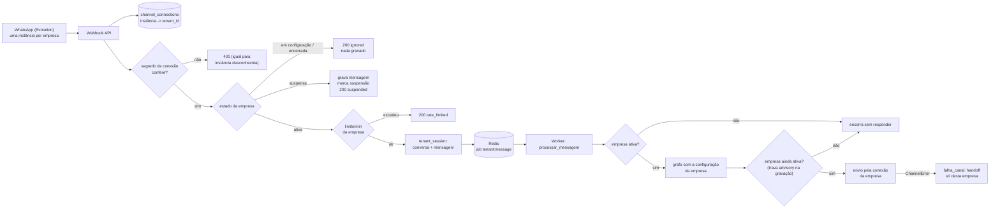
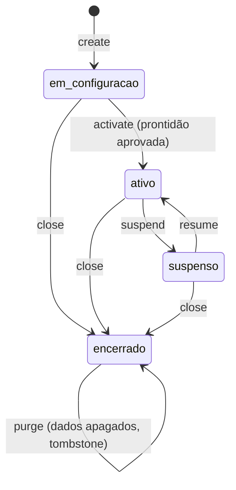

# Implementation Plan: Multi-tenancy real

**Branch**: `002-multitenancy` | **Date**: 2026-10-05 | **Spec**: [spec.md](spec.md)

**Input**: Feature specification from `/specs/002-multitenancy/spec.md`

## Summary

Transformar o Plantão.AI de "uma empresa fixa" (`PILOT_TENANT_ID`) em plataforma com várias empresas ativas ao
mesmo tempo: a empresa é identificada pela **conexão de canal** que recebeu a mensagem, cada conexão tem
credenciais próprias, o ciclo de vida da empresa (em configuração, ativa, suspensa, encerrada) é aplicado no
webhook e no worker, a configuração é editável com auditoria, e um comando de operador cria, valida, ativa,
suspende, encerra e apaga empresas de forma repetível. O isolamento passa a ser provado por uma suíte com três
empresas que roda em toda alteração.

Abordagem técnica (detalhes em [research.md](research.md)):

- **Resolução de empresa por conexão**: nova tabela `channel_connections` (diretório de roteamento, só colunas
  não sensíveis, leitura aberta e escrita restrita por RLS) e `channel_credentials` (segredos, RLS total). O
  webhook procura a conexão pelo identificador da instância do payload e **autentica com o segredo daquela
  conexão**; só depois entra em `tenant_session`.
- **Sem estado novo em memória**: o estado da empresa e a configuração são lidos do banco a cada mensagem (no
  webhook e no worker). Suspensão, reativação e mudança de regra valem na próxima mensagem, sem cache nem reinício.
- **Ciclo de vida e auditoria no banco**: `tenants.status` com CHECK, `audit_log` append-only (sem segredos),
  `readiness_checks` para a prontidão. Transições validadas em `core/tenancy/ciclo_vida.py`.
- **Onboarding idempotente por arquivo**: `scripts/tenants.py create --file empresa.yml` com chave natural `slug`;
  cada passo (empresa, configuração, conexão, documentos) é um upsert, então repetir o comando continua de onde
  parou. Segredos entram por **nome de variável de ambiente**, nunca no arquivo nem na saída (FR-005).
- **Canal por conexão**: a porta `MessageChannel` passa a receber a conexão (`ConexaoCanal`); a falha de uma
  conexão vira `status_envio = falha` + handoff `falha_canal` só naquela empresa.
- **Exclusão com drenagem**: encerrar bloqueia respostas; apagar dados exige confirmação pelo nome, espera a
  drenagem dos jobs em andamento e remove tudo da empresa em uma transação, mantendo só a trilha de auditoria.
- **Prova de isolamento**: suíte com 3 empresas, teste por introspecção (toda tabela com `tenant_id` tem RLS
  forçado e ao menos um cenário) e teste que quebra o isolamento de propósito e exige falha.

Fora do plano (spec): agendamento, SDR, cobrança, painel, fila de atendentes, outros canais, chaves por empresa,
interface web (a landing page é a spec [003-landing-page](../003-landing-page/spec.md)).

## Technical Context

**Language/Version**: Python 3.11 (venv atual 3.11.7)

**Primary Dependencies**: FastAPI, SQLAlchemy 2 async + asyncpg, Alembic, pgvector, ARQ/Redis, pydantic v2,
httpx, cryptography (Fernet). **Nova dependência de runtime**: `pyyaml` (hoje só em `requirements-dev.txt`) para
ler o arquivo de onboarding; justificada em [research.md](research.md) R-09. Nenhuma outra.

**Storage**: PostgreSQL 16 + pgvector (RLS por `tenant_id`, migração 0004); Redis 7 (fila ARQ e contadores de
limite, chaves já prefixadas por empresa).

**Testing**: pytest + pytest-asyncio. Unitários sem rede (config, ciclo de vida, arquivo de onboarding,
prontidão); integração com Postgres/Redis do docker-compose (isolamento com 3 empresas, resolução de conexão,
onboarding repetível, suspensão, exclusão, auditoria, migração 0004); contrato para webhook e canal;
adversarial com tentativa de acessar dados de outra empresa; avaliação com LLM real em `scripts/run_evals.py`
(manual).

**Target Platform**: Linux server (Railway/Render) em produção; Windows + Docker Desktop em desenvolvimento.

**Project Type**: web-service (API + worker) em monorepo modular, mais CLI do operador; sem frontend.

**Performance Goals**: resposta ao cliente final em até 10 s para 90% das mensagens por empresa (SC-004, SC-006);
webhook responde 200 em < 500 ms (acrescenta 1 leitura de diretório e 1 transação por mensagem); suspensão e
mudança de configuração valem na próxima mensagem (SC-004, SC-005, limite da spec: 1 minuto).

**Constraints**: LLM só via OpenRouter; webhook nunca espera LLM; nenhum segredo em log, saída de comando ou
auditoria; PII mascarada em logs; sem empresa padrão implícita (FR-021); migração Alembic reversível; migração
já aplicada não é editada (0004 nova).

**Scale/Scope**: 3 empresas em teste, 5 a 10 no primeiro semestre, ~100 conversas/dia por empresa, ~2 000
trechos de conhecimento por empresa. Uma conexão de canal por empresa e canal.

## Constitution Check

*GATE: Must pass before Phase 0 research. Re-check after Phase 1 design.*

Avaliação contra `.specify/memory/constitution.md` v1.0.0. Os gates II, III, IV, V e VII são bloqueantes.

| Princípio | Gate | Situação | Como o plano atende |
|---|---|---|---|
| I. Stack | Python 3.11 tipado; mypy estrito em `core/`, `agents/`, `db/`; LLM só por `core/llm`; deps fixadas | PASS com ação | Todo código novo em `core/tenancy` e `db/` tipado. `pyyaml` entra em `requirements.txt` e nos lockfiles (`pip-compile`) |
| II. Modularidade | Dependência `apps > agents > core > db`; DI; sem estado global; webhook não espera LLM; worker idempotente | PASS | `core/tenancy` só importa `db` e portas de `core`. A conversa simulada, que usa o grafo, roda em `scripts/tenants.py` (camada de aplicação) e só grava o resultado via `core/tenancy/prontidao`. Canal por conexão entra pela porta (`ConexaoCanal`), sem importar `integrations`. Remoção de `get_tenant_id()` fixo e de `settings.tenant_piloto()`. Idempotência por `(tenant_id, external_id)` já existe e é testada entre empresas (FR-025) |
| III. Multi-tenancy | `tenant_id NOT NULL`; RLS; tenant por sessão; RAG, cache, filas e logs particionados; teste de isolamento | PASS com exceção justificada | 4 tabelas novas com `tenant_id` e RLS forçado. Teste por introspecção impede nova tabela sem RLS. Chaves Redis e id de job com prefixo de empresa. Exceção: leitura aberta em `channel_connections` (roteamento), ver Complexity Tracking |
| IV. Segurança/LGPD | Segredos por env; webhook autenticado; rate limit por tenant; PII criptografada e mascarada; opt-in; exclusão sob demanda; auditoria | PASS | Segredo de entrega por conexão (só o hash no banco), chave de envio com Fernet, segredos lidos de variável de ambiente e nunca impressos. Limite por empresa vindo da configuração. `conversations.iniciada_por` registra a base do contato. Exclusão de dados (US6) com confirmação e trilha sem PII. Auditoria de configuração, estado e conexão |
| V. Guardrails | Todo envio passa por `core/guardrails`; humano no loop; testes adversariais antes | PASS | Guardrails inalterados e aplicados com a configuração da empresa de cada mensagem (US1 cenário 2 testado com duas empresas). Falha de canal e suspensão levam a "não responder" ou a handoff. Caso adversarial novo: pedido de dados de outra empresa, escrito antes da implementação |
| VI. SDD/Qualidade | Spec aprovada; cobertura 80%/100% guardrails; DoD; Alembic reversível | PASS | Spec em `specs/002-multitenancy`. Migração 0004 com `downgrade` testado. ADR 0003 e 0004 listados na estrutura |
| VII. Observabilidade/Custo | Log JSON com `correlation_id`, `tenant_id`, `conversation_id`; custo por tenant; rate limit por tenant | PASS | `definir_contexto(tenant_id=...)` agora vem da conexão resolvida. `llm_calls` e `usage_metrics` continuam por empresa (FR-031). Rate limit por empresa configurável. Alerta e orçamento automáticos seguem no Sprint 6 (já registrado no plano da 001) |
| VIII. Simplicidade | YAGNI; sem microserviços; nova dependência justificada; ADR para decisão relevante | PASS | Uma fila, um worker, uma conexão por empresa e canal, sem cache de configuração, sem chave por empresa, sem interface web. 1 dependência já presente em dev. Nenhum diretório de topo novo |

**Re-avaliação pós-design (Phase 1)**: PASS em todos os gates. As exceções de III (leitura aberta do diretório
de conexões) e de operação (papel administrativo ignora RLS) estão em Complexity Tracking e em
[data-model.md](data-model.md) e [research.md](research.md) R-01 e R-16.

## Project Structure

### Documentation (this feature)

```text
specs/002-multitenancy/
├── plan.md                         # Este arquivo
├── research.md                     # Phase 0
├── data-model.md                   # Phase 1
├── quickstart.md                   # Phase 1
├── contracts/
│   ├── whatsapp-webhook.md         # Webhook autenticado por conexão (altera o contrato da 001)
│   ├── channel-port.md             # Porta MessageChannel com ConexaoCanal e verificação
│   ├── tenants-cli.md              # Comandos do operador (ciclo de vida, configuração, auditoria)
│   └── onboarding-file.md          # Esquema do arquivo de configuração da empresa
├── checklists/requirements.md
└── tasks.md                        # Phase 2 (/speckit.tasks, não criado aqui)
```

### Source Code (repository root: `plantao-ai/`)

```text
core/
├── tenancy/                          # NOVO
│   ├── __init__.py                   # API pública (__all__)
│   ├── config.py                     # ConfigEmpresa (pydantic): validação e modelo padrão
│   ├── ciclo_vida.py                 # estados, transições permitidas, bloqueios
│   ├── resolucao.py                  # conexão -> empresa; autenticação da entrega
│   ├── conexoes.py                   # cadastro de conexão e credenciais (Fernet, hash)
│   ├── auditoria.py                  # registrar_mudanca (sem segredos)
│   ├── prontidao.py                  # avaliar_prontidao, registrar_teste
│   ├── onboarding.py                 # ArquivoEmpresa (pydantic), criar_ou_continuar
│   └── exclusao.py                   # encerrar, apagar_dados
├── ports/channel.py                  # ALTERADO: ConexaoCanal, verificar()
├── handoff/textos.py                 # ALTERADO: constante do motivo `falha_canal` (sem texto: o canal falhou)
└── config.py                         # ALTERADO: remove pilot_tenant_id, instância e chaves globais
db/
├── config_padrao.py                  # NOVO: CONFIG_PADRAO (modelo único de valores padrão)
├── models.py                         # ALTERADO (ver data-model.md)
├── repositories.py                   # ALTERADO: conversa com origem e marca de suspensão
└── migrations/versions/0004_multitenancy.py   # NOVO
integrations/whatsapp/client.py       # ALTERADO: instância no parse, credencial por chamada, verificar()
apps/
├── api/
│   ├── deps.py                       # ALTERADO: remove tenant fixo; dependência de conexão autenticada
│   └── webhooks/whatsapp.py          # ALTERADO: resolve e autentica por conexão; estados da empresa
├── composition.py                    # ALTERADO: canal compartilhado (um pool HTTP)
└── worker/{jobs.py,settings.py}      # ALTERADO: estado da empresa, TTL e canal por conexão, falha_canal
agents/orchestrator/state.py          # ALTERADO: ConfigTenant ganha os 2 campos novos
scripts/
├── tenants.py                        # NOVO: CLI do operador (contrato em contracts/tenants-cli.md)
├── ingest_docs.py                    # ALTERADO: --tenant obrigatório
├── run_evals.py                      # ALTERADO: --tenant obrigatório; suíte de isolamento entre empresas
└── seed_tenant.py                    # REMOVIDO (substituído por tenants.py e docs/exemplos/)
docs/
├── exemplos/{piloto.yml,empresa-modelo.yml}   # NOVO: arquivos de onboarding de exemplo
├── RUNBOOK_INCIDENTE.md              # NOVO: pausa e retomada de empresa (seção 8.10)
└── adr/{0003-resolucao-por-conexao.md,0004-exclusao-de-dados-de-empresa.md}   # NOVO
tests/
├── unit/                             # config, ciclo de vida, arquivo de onboarding, prontidão
├── integration/                      # isolamento (3 empresas), cobertura por introspecção, resolução,
│                                     # onboarding, suspensão, exclusão, auditoria, migração 0004
├── contract/                         # webhook por conexão, canal por conexão
├── adversarial/                      # pedido de dados de outra empresa
├── fakes/channel.py                  # ALTERADO: FakeChannel por conexão
└── evals/docs_empresa_b/ e docs_empresa_c/   # NOVO: documentos fictícios para a suíte de isolamento
.env.example  README.md  Makefile  requirements.txt (+ lock)   # ALTERADOS
```

**Structure Decision**: manter o monorepo modular sem novos diretórios de topo (constitution, restrições
adicionais). A lógica de empresa entra em um pacote novo `core/tenancy` (reúso real: API, worker e CLI),
respeitando `apps > agents > core > db`. Tudo que precisa do grafo (conversa simulada) fica em `scripts/`, que não
é camada do import-linter. Contrato import-linter novo: `core.tenancy` não importa `integrations`, `agents` nem
`apps` (já coberto por `core-isolado`); `db` não importa `core.tenancy` (por isso `CONFIG_PADRAO` vive em `db/`).

### Fluxo de uma mensagem (multi-empresa)



### Ciclo de vida



## Complexity Tracking

> Preencher apenas para violações de gate que precisam de justificativa.

| Violação | Por que é necessária | Alternativa mais simples rejeitada porque |
|---|---|---|
| `channel_connections` tem leitura aberta entre empresas (policy `FOR SELECT USING (true)`), contra o princípio III | O webhook precisa descobrir a empresa **antes** de ter um `tenant_id` na sessão. A tabela só tem colunas não sensíveis (instância, canal, `tenant_id`); escrita continua restrita por RLS e segredos ficam em `channel_credentials` com RLS total | Função `SECURITY DEFINER` depende do papel dono da tabela ignorar RLS (hoje só funciona porque o dono é superusuário no Docker). Consultar com papel administrativo no webhook amplia o privilégio da API inteira |
| CLI do operador usa o papel administrativo (`DATABASE_ADMIN_URL`), que ignora RLS | Criar empresa, mudar estado, listar todas as empresas e apagar dados são operações de plano de controle entre empresas. É o padrão já usado por `seed_tenant.py` | Um terceiro papel `plantao_ops` com políticas próprias é infraestrutura sem segundo operador que a justifique (YAGNI). Mitigação: papel administrativo só em `scripts/`, nunca em `apps/`, e verificado por teste de importação |
| Tabela `audit_log` sem chave estrangeira para `tenants` | A trilha da exclusão precisa sobreviver ao apagamento dos dados da empresa (US6 cenário 4) | FK com `ON DELETE CASCADE` apagaria a prova da exclusão; `SET NULL` perderia a identificação da empresa |
